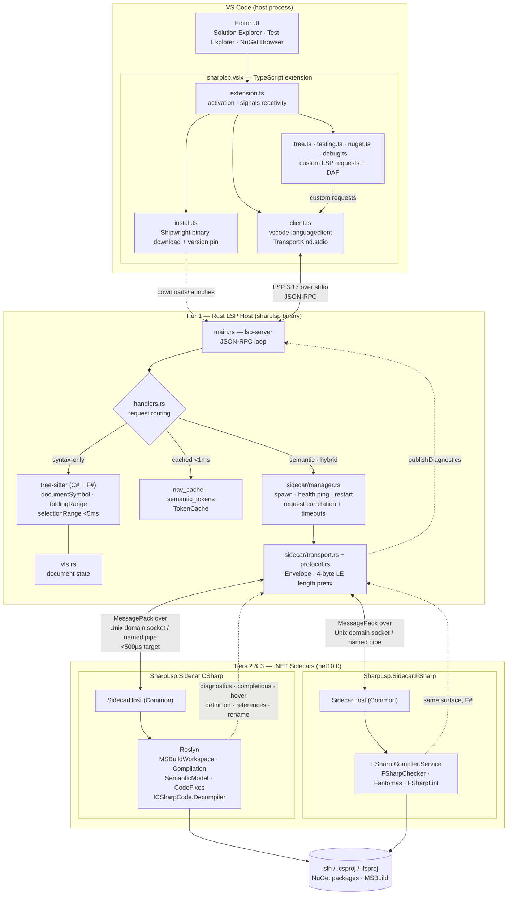

# Architecture Diagram

Visual companion to [SHARPLSP-SPEC.md](SHARPLSP-SPEC.md) §2 (Architecture). This document is
**diagram-only**: it does not restate tier responsibilities, transport properties, routing
tables, or lifecycle rules — those live in §2.1–§2.4 and are the source of truth. Everything
here maps a spec concept onto the code that implements it.

## `[ARCH-DIAGRAM-TIERS]` VSIX → LSP host → Roslyn/FCS

## `[ARCH-DIAGRAM-BOUNDARIES]` What the diagram asserts

- **The VSIX never talks to Roslyn.** It speaks LSP (plus custom requests) to the Rust host
  over **stdio** only. Beyond that its jobs are binary acquisition and UI surfaces.
- **The Rust host is the router.** Syntax-only work is answered locally from tree-sitter;
  semantic work is forwarded to a sidecar. See §2.3.
- **Two protocols, not one.** Editor↔host is JSON-RPC/LSP over stdio; host↔sidecar is
  MessagePack `Envelope` frames with a 4-byte little-endian length prefix over Unix domain
  socket / named pipe. See §2.2.
- **C# and F# are peers.** Both sidecars share `SharpLsp.Sidecar.Common`'s `SidecarHost` and
  the same RPC surface. Neither is primary. Process isolation per §2.4.

## `[ARCH-DIAGRAM-CODE-MAP]` Node → implementation

| Diagram node | Implementation |
|---|---|
| `client.ts` — stdio transport | [editors/vscode/src/client.ts:53](../../editors/vscode/src/client.ts#L53) |
| `install.ts` — binary acquisition | [editors/vscode/src/install.ts](../../editors/vscode/src/install.ts) |
| Custom requests + DAP | [tree.ts](../../editors/vscode/src/tree.ts), [testing.ts](../../editors/vscode/src/testing.ts), [nuget.ts](../../editors/vscode/src/nuget.ts), [debug.ts](../../editors/vscode/src/debug.ts) |
| `main.rs` — JSON-RPC loop | [src/main.rs](../../src/main.rs) |
| Request routing | [src/handlers.rs](../../src/handlers.rs) |
| tree-sitter parsing | [src/tree_sitter_parse.rs](../../src/tree_sitter_parse.rs), [src/syntax.rs](../../src/syntax.rs) |
| Document state (VFS) | [src/vfs.rs](../../src/vfs.rs) |
| Caches | [src/nav_cache.rs](../../src/nav_cache.rs), [src/semantic_tokens.rs](../../src/semantic_tokens.rs) |
| Sidecar lifecycle, `[SIDECAR-REQUEST-TIMEOUT]` | [src/sidecar/manager.rs](../../src/sidecar/manager.rs) |
| Framing + envelope | [src/sidecar/transport.rs](../../src/sidecar/transport.rs), [src/sidecar/protocol.rs](../../src/sidecar/protocol.rs) |
| Shared sidecar host | [sidecars/SharpLsp.Sidecar.Common/SidecarHost.cs](../../sidecars/SharpLsp.Sidecar.Common/SidecarHost.cs) |
| C# sidecar (Roslyn) | [sidecars/SharpLsp.Sidecar.CSharp/](../../sidecars/SharpLsp.Sidecar.CSharp/) |
| F# sidecar (FCS) | [sidecars/SharpLsp.Sidecar.FSharp/](../../sidecars/SharpLsp.Sidecar.FSharp/) |
| Diagnostics publication | [src/diagnostics.rs](../../src/diagnostics.rs), [src/pull_diagnostics.rs](../../src/pull_diagnostics.rs) |
