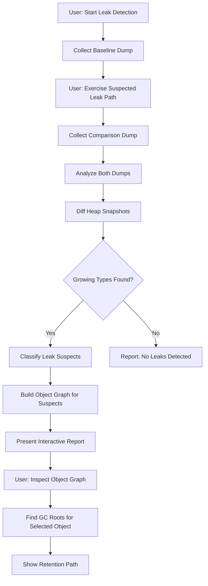
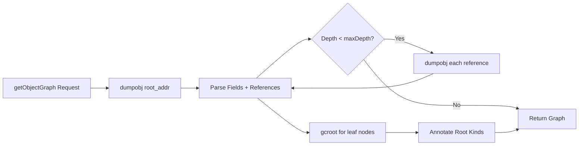
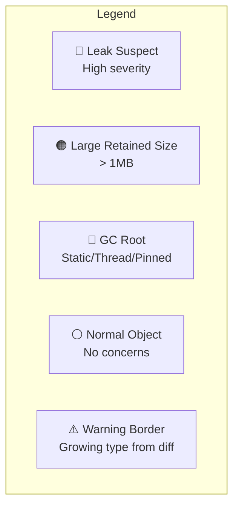

# Profiler Integration Specification

**Parent:** [SHARPLSP-SPEC.md](SHARPLSP-SPEC.md)

## 1. Overview

SharpLsp integrates .NET diagnostic tools (`dotnet-trace`, `dotnet-counters`, `dotnet-dump`) directly into the editor via LSP custom requests, giving developers a simple UI around the standard .NET diagnostics CLI. No external tools, no terminal juggling — profile, trace, and analyze memory leaks from your editor.

**Reference:** [dotnet-trace documentation](https://learn.microsoft.com/en-us/dotnet/core/diagnostics/dotnet-trace)

**Priority:** P2 (Phase 5 — Beyond Parity)

## 2. Diagnostic Tools

### 2.1 dotnet-trace

Collects performance traces from running .NET processes using EventPipe. Produces `.nettrace` files convertible to Chromium/SpeedScope formats for visualization.

| Capability | CLI Equivalent | Description |
|-----------|---------------|-------------|
| List processes | `dotnet-trace ps` | Discover running .NET processes |
| Collect trace | `dotnet-trace collect -p <pid>` | Attach and record EventPipe trace |
| Stop trace | Ctrl+C equivalent | Gracefully stop collection |
| Convert trace | `dotnet-trace convert` | Convert `.nettrace` to `.speedscope.json` or Chromium format |

### 2.2 dotnet-counters

Real-time monitoring of .NET runtime performance counters (GC, CPU, exceptions, thread pool).

| Capability | CLI Equivalent | Description |
|-----------|---------------|-------------|
| List processes | `dotnet-counters ps` | Discover running .NET processes |
| Monitor counters | `dotnet-counters monitor -p <pid>` | Stream live counter values |
| Collect counters | `dotnet-counters collect -p <pid>` | Record counters to CSV/JSON |

### 2.3 dotnet-dump (Memory Leak Tracing)

Captures and analyzes process dumps for memory leak investigation without a native debugger.

| Capability | CLI Equivalent | Description |
|-----------|---------------|-------------|
| Collect dump | `dotnet-dump collect -p <pid>` | Capture managed heap dump |
| Analyze dump | `dotnet-dump analyze <file>` | Open interactive analysis session |
| Heap stats | `dumpheap -stat` | Show object type counts and sizes |
| GC roots | `gcroot <addr>` | Trace GC root references for an object |
| Object references | `dumpobj <addr>` | Inspect individual managed objects |

## 3. Architecture

### 3.1 Component Placement

Profiler integration lives in the **Rust LSP host** (Tier 1). The diagnostic CLI tools run as child processes managed by the host — no sidecar involvement.

```
Editor  ──LSP custom request──▶  Rust Host  ──spawns──▶  dotnet-trace / dotnet-counters / dotnet-dump
                                     │
                                     ├── Process discovery (dotnet-trace ps)
                                     ├── Session lifecycle (start / stop / convert)
                                     └── Output parsing + streaming to editor
```

### 3.2 Why Rust Host, Not Sidecar

- Diagnostic tools are standalone CLI executables, not Roslyn/FCS APIs
- No workspace or compilation context needed
- Direct process spawning from Rust is simpler and lower latency
- Sidecar crash must not kill profiling sessions

### 3.3 Tool Discovery

On startup (lazy, first use), the host locates diagnostic tools:

| Step | Action | Fallback |
|------|--------|----------|
| 1 | Check `PATH` for `dotnet-trace`, `dotnet-counters`, `dotnet-dump` | — |
| 2 | Check `dotnet tool list -g` output | — |
| 3 | If missing, prompt user to install via `dotnet tool install -g` | Return error with install instructions |

## 4. LSP Custom Requests

All profiler requests use the `sharplsp/` namespace.

### 4.1 Process Discovery

**Method:** `sharplsp/profiler/listProcesses`

**Params:**
```typescript
interface ListProcessesParams {}
```

**Result:**
```typescript
interface DotNetProcess {
  pid: number;
  name: string;
  commandLine: string;
}

type ListProcessesResult = DotNetProcess[];
```

Calls `dotnet-trace ps` and parses output. Returns all discoverable .NET processes.

### 4.2 Trace Session

**Method:** `sharplsp/profiler/startTrace`

**Params:**
```typescript
interface StartTraceParams {
  pid: number;
  /** EventPipe profile: "cpu-sampling", "gc-verbose", "gc-collect", or custom provider string */
  profile?: string;
  /** Output format: "nettrace" | "speedscope" | "chromium". Default: "speedscope" */
  format?: string;
  /** Max duration in seconds. 0 = unlimited. Default: 30 */
  duration?: number;
  /** Output file path. Auto-generated if omitted */
  outputPath?: string;
}
```

**Result:**
```typescript
interface StartTraceResult {
  sessionId: string;
  outputPath: string;
}
```

**Method:** `sharplsp/profiler/stopTrace`

**Params:**
```typescript
interface StopTraceParams {
  sessionId: string;
}
```

**Result:**
```typescript
interface StopTraceResult {
  outputPath: string;
  fileSizeBytes: number;
  durationMs: number;
}
```

### 4.2.1 Trace File Conversion

A `.nettrace` file is not directly viewable — it must be converted to SpeedScope JSON (or Chromium JSON) before it can be opened in a visualizer. SharpLsp exposes an explicit conversion entrypoint so that any trace file on disk (including orphaned files from a previous session, a colleague's dump, or a CI artifact) can be opened in SharpLsp without re-recording.

**Method:** `sharplsp/profiler/convertTrace`

**Params:**
```typescript
interface ConvertTraceParams {
  /** Absolute path to a `.nettrace` file. */
  inputPath: string;
  /** Output format: "speedscope" (default) or "chromium". */
  format?: "speedscope" | "chromium";
}
```

**Result:**
```typescript
interface ConvertTraceResult {
  /** Path to the converted file — always a sibling of inputPath. */
  outputPath: string;
  /** Size of the converted file in bytes. */
  fileSizeBytes: number;
}
```

Invokes `dotnet-trace convert <input> --format <format>`. The resulting sibling file is:

| Format | Output sibling |
|--------|----------------|
| `speedscope` | `<input>.speedscope.json` |
| `chromium` | `<input>.chromium.json` |

Stopping a trace session (`sharplsp/profiler/stopTrace`) already runs this conversion automatically when the session produced data. `convertTrace` is for files where no live session exists — for example, when the editor was closed during recording, or when opening a `.nettrace` the user recorded elsewhere.

### 4.3 Counter Monitoring

**Method:** `sharplsp/profiler/startCounters`

**Params:**
```typescript
interface StartCountersParams {
  pid: number;
  /** Counter providers. Default: ["System.Runtime"] */
  providers?: string[];
  /** Refresh interval in seconds. Default: 1 */
  refreshInterval?: number;
}
```

**Result:**
```typescript
interface StartCountersResult {
  sessionId: string;
}
```

Counter values streamed via LSP notification:

**Notification:** `sharplsp/profiler/counterUpdate`

```typescript
interface CounterUpdateParams {
  sessionId: string;
  counters: CounterValue[];
}

interface CounterValue {
  provider: string;
  name: string;
  displayName: string;
  value: number;
  unit: string;
}
```

**Method:** `sharplsp/profiler/stopCounters`

**Params:**
```typescript
interface StopCountersParams {
  sessionId: string;
}
```

### 4.4 Memory Dump Collection

**Method:** `sharplsp/profiler/collectDump`

**Params:**
```typescript
interface CollectDumpParams {
  pid: number;
  /** Dump type: "full" | "heap" | "mini". Default: "heap" */
  dumpType?: string;
  /** Output file path. Auto-generated if omitted */
  outputPath?: string;
}
```

**Result:**
```typescript
interface CollectDumpResult {
  outputPath: string;
  fileSizeBytes: number;
}
```

### 4.5 Memory Dump Analysis

**Method:** `sharplsp/profiler/analyzeHeap`

**Params:**
```typescript
interface AnalyzeHeapParams {
  dumpPath: string;
  /** Max rows to return. Default: 50 */
  limit?: number;
  /** Filter by type name substring */
  typeFilter?: string;
}
```

**Result:**
```typescript
interface HeapStats {
  totalObjects: number;
  totalSizeBytes: number;
  types: HeapTypeInfo[];
}

interface HeapTypeInfo {
  typeName: string;
  count: number;
  totalSizeBytes: number;
}
```

**Method:** `sharplsp/profiler/findGCRoots`

**Params:**
```typescript
interface FindGCRootsParams {
  dumpPath: string;
  /** Object address (hex string) */
  objectAddress: string;
}
```

**Result:**
```typescript
interface GCRootChain {
  roots: GCRootNode[];
}

interface GCRootNode {
  address: string;
  typeName: string;
  rootKind: string;
}

type FindGCRootsResult = GCRootChain[];
```

## 5. Memory Leak Tracing Workflow

Memory leak investigation follows a structured workflow exposed through the UI:

### 5.1 Baseline → Exercise → Compare

| Step | Action | Tool |
|------|--------|------|
| 1 | Collect baseline heap dump | `sharplsp/profiler/collectDump` |
| 2 | Exercise the suspected leak path | (user action) |
| 3 | Collect second heap dump | `sharplsp/profiler/collectDump` |
| 4 | Compare heap stats between dumps | `sharplsp/profiler/analyzeHeap` on both |
| 5 | Identify growing types | Editor diff view of heap stats |
| 6 | Trace GC roots of suspect objects | `sharplsp/profiler/findGCRoots` |

### 5.2 Live Counter Monitoring for Leak Detection

Monitor `System.Runtime` counters to detect leaks in real-time:

| Counter | Leak Signal |
|---------|-------------|
| `gc-heap-size` | Monotonically increasing across Gen 2 collections |
| `gen-2-gc-count` | Unusually high frequency |
| `number-of-active-timers` | Growing without bound |
| `threadpool-queue-length` | Sustained growth |

The editor highlights counters that show sustained growth patterns.

### 5.3 Automated Leak Detection

SharpLsp automatically detects memory leaks by comparing two heap snapshots taken at different points in time. The user triggers "Baseline → Exercise → Compare" and SharpLsp does the analysis automatically.

#### 5.3.1 Heap Snapshot Diffing

**Method:** `sharplsp/profiler/diffHeapSnapshots`

**Params:**
```typescript
interface DiffHeapSnapshotsParams {
  /** Path to the baseline dump file */
  baselineDumpPath: string;
  /** Path to the comparison dump file */
  comparisonDumpPath: string;
  /** Only show types where count or size grew. Default: true */
  growingOnly?: boolean;
  /** Minimum growth percentage to report. Default: 10.0 */
  minGrowthPercent?: number;
  /** Max rows to return. Default: 50 */
  limit?: number;
}
```

**Result:**
```typescript
interface HeapDiffResult {
  baselineTotalObjects: number;
  baselineTotalSizeBytes: number;
  comparisonTotalObjects: number;
  comparisonTotalSizeBytes: number;
  /** Types sorted by size growth descending */
  diffs: HeapTypeDiff[];
  /** Types flagged as probable leaks */
  leakSuspects: LeakSuspect[];
}

interface HeapTypeDiff {
  typeName: string;
  baselineCount: number;
  comparisonCount: number;
  countDelta: number;
  baselineSizeBytes: number;
  comparisonSizeBytes: number;
  sizeDeltaBytes: number;
  growthPercent: number;
}

interface LeakSuspect {
  typeName: string;
  severity: "high" | "medium" | "low";
  reason: string;
  countDelta: number;
  sizeDeltaBytes: number;
}
```

#### 5.3.2 Leak Classification Heuristics

SharpLsp classifies leak suspects by combining snapshot diff data with heuristics:

| Severity | Criteria |
|----------|----------|
| **High** | Count grew >100% AND absolute size delta >1MB |
| **Medium** | Count grew >50% AND absolute size delta >100KB |
| **Low** | Count grew >10% AND absolute size delta >10KB |

Additional signals that elevate severity:
- Type is a known leak-prone pattern (event handlers, delegates, `CancellationTokenSource`, timers)
- Type contains `[]` or `List` (collection growth)
- Multiple instances of the same generic type growing (e.g., `Dictionary<TKey, TValue>` with different type args)

#### 5.3.3 Automated Leak Detection Flow



## 5A. Object Graph Visualization

SharpLsp provides an interactive object retention graph that shows what objects exist in memory and what's holding on to them. This is the killer feature for memory leak investigation — you see the actual reference chains keeping objects alive.

### 5A.1 Object Graph Data Model

**Method:** `sharplsp/profiler/getObjectGraph`

**Params:**
```typescript
interface GetObjectGraphParams {
  dumpPath: string;
  /** Starting object address (hex). If omitted, starts from leak suspects */
  rootAddress?: string;
  /** Max depth to traverse from root. Default: 5 */
  maxDepth?: number;
  /** Max nodes to return. Default: 200 */
  maxNodes?: number;
  /** Filter: only include paths through this type name (substring match) */
  typeFilter?: string;
}
```

**Result:**
```typescript
interface ObjectGraphResult {
  nodes: ObjectGraphNode[];
  edges: ObjectGraphEdge[];
  /** Summary statistics */
  stats: ObjectGraphStats;
}

interface ObjectGraphNode {
  /** Unique node ID (object address) */
  id: string;
  /** Fully qualified type name */
  typeName: string;
  /** Short display name (last segment of type) */
  displayName: string;
  /** Size in bytes of this single object */
  sizeBytes: number;
  /** Total retained size (this object + everything it keeps alive) */
  retainedSizeBytes: number;
  /** Number of instances of this type on the heap */
  instanceCount: number;
  /** Whether this node is a GC root */
  isRoot: boolean;
  /** The kind of root if isRoot is true */
  rootKind?: "Static" | "ThreadLocal" | "Pinned" | "Finalizer" | "Stack";
  /** Depth from the query root */
  depth: number;
}

interface ObjectGraphEdge {
  /** Source node ID (the holder) */
  from: string;
  /** Target node ID (the held object) */
  to: string;
  /** Field name or index that holds the reference */
  fieldName: string;
  /** Whether this is a strong or weak reference */
  referenceKind: "Strong" | "Weak";
}

interface ObjectGraphStats {
  totalNodesTraversed: number;
  totalEdgesTraversed: number;
  maxDepthReached: number;
  truncated: boolean;
}
```

### 5A.2 Object Inspection

**Method:** `sharplsp/profiler/inspectObject`

**Params:**
```typescript
interface InspectObjectParams {
  dumpPath: string;
  /** Object address (hex string) */
  objectAddress: string;
}
```

**Result:**
```typescript
interface ObjectInspection {
  address: string;
  typeName: string;
  sizeBytes: number;
  /** Field values for this object */
  fields: ObjectField[];
  /** Generation (0, 1, 2, LOH, POH) */
  generation: string;
  /** Whether the object is pinned */
  isPinned: boolean;
}

interface ObjectField {
  name: string;
  typeName: string;
  /** Value for primitives/strings, address for reference types */
  value: string;
  /** Whether this field holds a reference to another managed object */
  isReference: boolean;
  /** If isReference, the address of the referenced object */
  referenceAddress?: string;
}
```

### 5A.3 Architecture — How the Object Graph is Built

The object graph is assembled from `dotnet-dump analyze` commands:



Commands used per node:
| Command | Purpose |
|---------|---------|
| `dumpobj <addr>` | Get object type, size, field values |
| `gcroot <addr>` | Find what root chain keeps this object alive |
| `dumpheap -mt <MT>` | Count all instances of a specific method table |
| `objsize <addr>` | Calculate retained size (object + transitive refs) |

### 5A.4 Interactive Graph Webview

The object graph renders as an interactive force-directed graph in a VSCode webview panel.

#### Graph Layout

```mermaid
graph LR
    subgraph GC Roots
        R1[Static Field<br/>AppState._cache]
        R2[Thread Stack<br/>Main]
    end

    subgraph Retention Chain
        A[Dictionary&lt;string,Widget&gt;<br/>1.2 MB retained]
        B[Widget[]<br/>entries array]
        C[Widget<br/>48 bytes]
        D[EventHandler<br/>leak suspect ⚠️]
    end

    R1 -->|_cache| A
    A -->|entries| B
    B -->|[42]| C
    C -->|OnClick| D
    R2 -->|local| A
```

#### Webview Features

| Feature | Description |
|---------|-------------|
| **Force-directed layout** | D3.js physics simulation; nodes repel, edges attract |
| **Color coding** | Red = leak suspect, Orange = large retained size, Blue = GC root, Gray = normal |
| **Node sizing** | Node radius proportional to retained size |
| **Click to expand** | Click a node to fetch and display its children (lazy loading) |
| **Click to inspect** | Right-click a node to see full `dumpobj` output (field values) |
| **Hover tooltip** | Shows type name, size, instance count, retained size |
| **Filter by type** | Text input to filter visible nodes by type name |
| **Collapse subtree** | Double-click to collapse/expand a subtree |
| **Highlight path** | Click a leaf node to highlight the shortest GC root path |
| **Search** | Find objects by type name or address |
| **Export** | Save graph as SVG or PNG |
| **Depth slider** | Control max traversal depth (1–10) |

#### Node Visual Encoding



### 5A.5 Retention Path View

For any selected object, SharpLsp shows the complete chain from GC root to the object. This answers the question: **"Why isn't this being garbage collected?"**

```mermaid
graph TD
    Root["🔵 GC Root<br/>Static: AppState._instance"] --> A["AppState<br/>retains 4.2 MB"]
    A -->|_subscriptions| B["List&lt;EventHandler&gt;<br/>retains 2.1 MB"]
    B -->|[0]| C["EventHandler<br/>retains 1.0 MB"]
    C -->|_target| D["🔴 LeakyService<br/>48 bytes<br/>⚠️ 1,247 instances"]
    D -->|_buffer| E["byte[]<br/>1.0 MB"]

    style Root fill:#4488ff,color:#fff
    style D fill:#ff4444,color:#fff
    style E fill:#ff8844,color:#fff
```

Each node in the retention path shows:
- Type name and size
- The field name on the edge (what reference holds it)
- Instance count (if many instances of same type exist — leak signal)
- Retained size (total memory kept alive through this node)

### 5A.6 Heap Snapshot Diff Visualization

When two snapshots are compared, the diff is shown as an annotated table AND as a visual graph overlay.

#### Diff Table View

| Type | Baseline Count | Current Count | Delta | Baseline Size | Current Size | Delta | Severity |
|------|---------------|--------------|-------|--------------|-------------|-------|----------|
| `EventHandler` | 12 | 1,247 | +1,235 | 576 B | 59.9 KB | +59.3 KB | 🔴 High |
| `byte[]` | 340 | 1,580 | +1,240 | 1.2 MB | 5.6 MB | +4.4 MB | 🔴 High |
| `String` | 8,200 | 9,100 | +900 | 320 KB | 355 KB | +35 KB | 🟡 Low |

#### Diff Graph Overlay

In graph view, nodes from the comparison snapshot are annotated with growth indicators:
- **Pulsing red border** — count grew >100%
- **Growing arrow** — size delta shown on hover
- **New nodes** (not in baseline) appear with dashed border

### 5A.7 Performance Requirements

| Metric | Target |
|--------|--------|
| Object graph (depth 3, 200 nodes) | <3s |
| Object graph (depth 5, 200 nodes) | <8s |
| Object inspection (`dumpobj`) | <500ms |
| Heap diff (two 50k-type dumps) | <10s |
| Graph webview initial render | <500ms |
| Graph webview node expansion | <1s |
| Retained size calculation | <5s per node |

## 6. Session Management

### 6.1 Session Lifecycle

```
Created  ──start──▶  Running  ──stop──▶  Stopped  ──cleanup──▶  Disposed
                        │
                        └──timeout──▶  Stopped
                        └──error──▶  Failed
```

- Each session gets a unique ID (UUID v4)
- Sessions tracked in a `DashMap<String, ProfileSession>` on the Rust host
- Maximum concurrent sessions: 5 (configurable via `sharplsp.toml`)
- Orphaned sessions (editor disconnect) cleaned up on LSP shutdown

### 6.2 Configuration

`sharplsp.toml` settings:

```toml
[profiler]
max_concurrent_sessions = 5
default_trace_duration = 30
default_trace_format = "speedscope"
default_counter_providers = ["System.Runtime"]
default_counter_interval = 1
output_directory = ".sharplsp/profiles"
```

## 7. Editor Integration

### 7.1 VSCode Extension

| UI Element | Purpose |
|-----------|---------|
| Tree view panel | List running .NET processes, active sessions |
| Status bar item | Show active profiling session count |
| Command palette | Start/stop trace, start/stop counters, collect dump, leak detection |
| Webview panel | Display counter values as live-updating table |
| Webview panel | Display heap stats as sortable table |
| Webview panel | Interactive object retention graph (D3.js force-directed) |
| Webview panel | Heap snapshot diff table with growth indicators |
| Quick pick | Process selection from discovered .NET processes |
| File open | Open `.speedscope.json` output in browser/SpeedScope viewer |

### 7.1.1 Profiler Tree View — Intent-Revealing UX

The PROFILER tree view MUST make every action discoverable **directly from the node the user is looking at**. A user who right-clicks a session must be able to stop it. A user who right-clicks a process must be able to profile it. No toolbar hunting. No blind QuickPicks.

#### Tree Structure

```
PROFILER  [refresh]  [open-trace]  [⋯ overflow]
├── Active Sessions (N)
│   ├── 🔴 Trace: PID 7161  (recording · 42s)      ← contextValue: profiler-session-trace
│   └── 🟢 Counters: PID 8203  (streaming)         ← contextValue: profiler-session-counters
└── .NET Processes (N)
    ├── ProfileTarget (PID 1608)                   ← contextValue: profiler-process
    └── Claude (PID 98153)
```

#### Context Values

Every tree item MUST set a `contextValue` that the `view/item/context` menu `when` clauses key off:

| Tree Item | `contextValue` |
|-----------|---------------|
| Active Sessions header | `profiler-header-sessions` |
| .NET Processes header | `profiler-header-processes` |
| Trace session | `profiler-session-trace` |
| Counters session | `profiler-session-counters` |
| Process entry | `profiler-process` |

#### Default Click Behavior

Clicking a node performs the most common action for that node kind — never a no-op.

| Node | Default Click | Rationale |
|------|--------------|-----------|
| Trace session | Stop trace + open result in SpeedScope | Click = "I'm done, show me the flamegraph." |
| Counters session | Reveal the live counters webview | Click = "Show me the numbers" (stopping is a menu item). |
| Process | Start trace on this PID | Click = "profile this." |
| Header / empty | No-op | Informational. |

#### Context Menu (Right-Click) Entries

**On a trace session:**
- Stop & Open (inline icon = `debug-stop`)
- Reveal Output File in Finder
- Copy Output Path

**On a counters session:**
- Show Live Counters Panel (inline icon = `preview`)
- Stop Counter Monitoring

**On a process:**
- Start Trace on This Process (inline icon = `record`)
- Start Counters on This Process
- Collect Memory Dump of This Process
- Copy PID

#### Tooltips

Every session and process node MUST have a Markdown tooltip that includes:
- Node identity (PID, session ID, kind)
- Output path if any
- A one-line hint describing what clicking does

This eliminates "what is this thing and what do I do with it?" confusion.

#### Toolbar Organisation

The view title bar keeps only actions that don't belong to a specific node:

| Group | Command | Icon |
|-------|---------|------|
| `navigation@1` | Refresh | `refresh` |
| `navigation@2` | Open Trace File… | `folder-opened` |
| `overflow` | Start Trace (picker), Start Counters (picker), Collect Dump (picker), Convert .nettrace, Analyze Heap, Compare Snapshots, Detect Leaks | — |

The overflow menu (`⋯`) holds picker-based workflows that don't need a visible button. All direct-action equivalents live on the tree node context menus.

### 7.1.2 Trace File Opening

SharpLsp MUST let the user open a `.nettrace` **file** as a first-class action, not just as a side-effect of stopping a session. Users who find an orphaned `.nettrace` (e.g. because the editor was closed mid-recording) need a path forward.

The `sharplsp.profiler.openTrace` command:
1. Shows an open-file dialog filtering for `.nettrace`, `.speedscope.json`, and `.json` files.
2. If the chosen file is `.nettrace`, invokes `sharplsp/profiler/convertTrace` to produce a sibling `.speedscope.json`.
3. Opens the resulting SpeedScope file in the external SpeedScope web viewer.

Stopping a trace session uses the same pipeline, so the UX is consistent: every trace — freshly captured or loaded from disk — ends up in SpeedScope with one interaction.

### 7.2 Commands

| Command | Title |
|---------|-------|
| `sharplsp.profiler.listProcesses` | SharpLsp: List .NET Processes |
| `sharplsp.profiler.startTrace` | SharpLsp: Start Performance Trace |
| `sharplsp.profiler.stopTrace` | SharpLsp: Stop Performance Trace |
| `sharplsp.profiler.startCounters` | SharpLsp: Start Counter Monitoring |
| `sharplsp.profiler.stopCounters` | SharpLsp: Stop Counter Monitoring |
| `sharplsp.profiler.collectDump` | SharpLsp: Collect Memory Dump |
| `sharplsp.profiler.analyzeHeap` | SharpLsp: Analyze Heap Dump |
| `sharplsp.profiler.diffSnapshots` | SharpLsp: Compare Heap Snapshots |
| `sharplsp.profiler.detectLeaks` | SharpLsp: Detect Memory Leaks |
| `sharplsp.profiler.showObjectGraph` | SharpLsp: Show Object Retention Graph |
| `sharplsp.profiler.inspectObject` | SharpLsp: Inspect Object |
| `sharplsp.profiler.openTrace` | SharpLsp: Open Trace File… |
| `sharplsp.profiler.convertTrace` | SharpLsp: Convert .nettrace to SpeedScope |
| `sharplsp.profiler.stopSession` | SharpLsp: Stop Session |
| `sharplsp.profiler.revealOutput` | SharpLsp: Reveal Output File in Finder |
| `sharplsp.profiler.copyOutputPath` | SharpLsp: Copy Output Path |
| `sharplsp.profiler.showCountersPanel` | SharpLsp: Show Live Counters Panel |
| `sharplsp.profiler.traceProcess` | SharpLsp: Start Trace on This Process |
| `sharplsp.profiler.countersProcess` | SharpLsp: Start Counters on This Process |
| `sharplsp.profiler.dumpProcess` | SharpLsp: Collect Memory Dump of This Process |
| `sharplsp.profiler.copyPid` | SharpLsp: Copy PID |

## 8. Performance Requirements

| Metric | Target |
|--------|--------|
| Process list refresh | <500ms |
| Trace start latency | <1s (tool spawn + attach) |
| Counter update delivery | <100ms from tool output to editor notification |
| Dump collection | Depends on process size; UI must show progress |
| Heap analysis (50k types) | <5s |
| GC root traversal | <10s |

## 9. Error Handling

| Condition | Response |
|-----------|----------|
| Diagnostic tool not installed | Return error with `dotnet tool install` command |
| Target process exited | Stop session, notify editor, return partial data |
| Permission denied (attach) | Return error with elevation instructions |
| Trace file write failure | Return error with path and OS error |
| Session limit exceeded | Return error listing active sessions |
| Tool produces unexpected output | Log raw output at `warn` level, return parse error |
| Editor disconnects during session | Clean up all sessions on LSP shutdown |

## 10. Competitive Parity Matrix

| Feature | VS | Rider | CDK | SharpLsp Target | Priority |
|---------|----|----|-----|-------------|----------|
| CPU trace collection | Yes | Yes | No | Yes | P0 |
| Live performance counters | Yes (PerfView) | Yes | No | Yes | P0 |
| Memory dump collection | Yes | Yes | No | Yes | P0 |
| Heap analysis | Yes | Yes (dotMemory) | No | Yes (basic) | P1 |
| GC root analysis | Yes | Yes (dotMemory) | No | Yes (basic) | P1 |
| Leak detection heuristics | Partial | Yes | No | Yes (counter-based) | P1 |
| Automated leak detection | No | Yes (dotMemory) | No | Yes (snapshot diff) | P1 |
| Heap snapshot diffing | No | Yes (dotMemory) | No | Yes | P1 |
| Object retention graph | Yes | Yes (dotMemory) | No | Yes (interactive) | P1 |
| Object inspection | Yes | Yes (dotMemory) | No | Yes | P1 |
| Flame graph visualization | External | Built-in | No | External (SpeedScope) | P1 |
| Allocation tracking | Yes | Yes (dotTrace) | No | Future | P2 |
