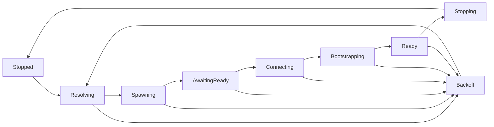

# Sidecar Lifecycle and IPC Reliability Specification `[SIDECAR]`

**Status:** Normative — required behavior; implementation completeness is tracked in the plan · **Applies to:** Rust LSP host, shared .NET sidecar host, C# sidecar, F# sidecar · **Implementation plan:** [SIDECAR-LIFECYCLE-PLAN.md](../plans/SIDECAR-LIFECYCLE-PLAN.md)

The words **MUST**, **MUST NOT**, **SHOULD**, and **MAY** are normative. Implementations and tests cite the most specific applicable stable ID.

## Objective `[SIDECAR-LIFECYCLE-OBJECTIVE]`

SharpLsp runs C# and F# semantic engines in independent .NET processes. The lifecycle MUST resolve a spawnable artifact, create an isolated IPC endpoint, establish a correlated session, restore desired workspace state, distinguish slow work from failure, and terminate the complete process tree.

The lifecycle subsystem MUST make that sequence one state machine. A request, heartbeat, process exit, startup timeout, editor shutdown, and parent-death event MUST all be serialized through that same owner. No caller may independently spawn, reconnect, back off, or kill a sidecar.

### Scope `[SIDECAR-LIFECYCLE-SCOPE]`

This specification defines:

- C# and F# sidecar executable resolution and launch fallback;
- per-spawn IPC endpoint allocation and the pre-IPC `READY` handshake;
- supervisor states, generation fencing, request admission, and restart backoff;
- frame ownership, response correlation, notification dispatch, cancellation, and timeouts;
- health checks that distinguish idle, busy, stalled, and dead sidecars;
- workspace/configuration/document rehydration after a new generation starts;
- graceful shutdown, hard termination, parent-death detection, and descendant cleanup;
- cross-platform security, observability, performance budgets, and end-to-end acceptance tests.

The contract is identical for the Roslyn and FCS sidecars unless a requirement explicitly names a platform. C# and F# retain separate supervisor instances, endpoint generations, backoff counters, and process-containment scopes.

### Non-goals `[SIDECAR-LIFECYCLE-NONGOALS]`

This work does not change Roslyn/FCS feature behavior, MessagePack DTO payloads owned by individual features, LSP client restart policy, or editor binary acquisition. It does not introduce a remote IPC transport or treat sidecar IPC as a cross-user trust boundary. It also does not make semantic handlers concurrent: the v1 connection driver deliberately admits one host-to-sidecar request at a time while still receiving interleaved sidecar notifications.

## Ownership and State `[SIDECAR-ARCHITECTURE]`

### Component Ownership `[SIDECAR-ARCHITECTURE-OWNERSHIP]`

| Component | Sole responsibilities | MUST NOT own |
|---|---|---|
| `SidecarManager` facade | Stable API used by LSP features; converts supervisor results into typed errors | Child handles, endpoint cleanup, transport reads, backoff sleeps |
| Supervisor task | State transitions, generation number, launch candidates, process containment, bootstrap, backoff, shutdown | Feature-specific MessagePack payload logic |
| Connection driver task | Sole ownership of one `FramedTransport`; frame reads/writes; active request ID; notification dispatch | Process spawning, retry policy, workspace selection |
| Rust session state | Desired workspace target, analyzer configuration, and authoritative open-document snapshots | Roslyn/FCS semantic state |
| Shared .NET `SidecarHost` | Listener, handshake, sequential dispatch, response flush, parent watchdog, local process containment | Host retry/backoff policy |
| C#/F# engines | Language-specific handlers and semantic state | IPC lifecycle or process ownership |

There MUST be exactly one supervisor task and at most one connection driver per language. Public methods communicate with them through bounded channels and await `Result` values. They MUST NOT hold a mutex across process spawn, IPC, sleep, or user-code awaits.

### Supervisor State Model `[SIDECAR-STATE-MODEL]`



| State | Required owned resources | Request behavior |
|---|---|---|
| `Stopped` | No child, transport, listener endpoint, or retry timer | First eligible operation starts resolution |
| `Resolving` | Candidate list for the next generation | Concurrent callers join the same readiness waiter |
| `Spawning` | Generation, candidate, endpoint lease, containment scope, child | Concurrent callers continue waiting; no second spawn |
| `AwaitingReady` | Running child and capped stdout/stderr collectors | Only handshake/process/timeout events are accepted |
| `Connecting` | Validated handshake and effective endpoint | Connection retry is bounded; no feature request is written |
| `Bootstrapping` | Connection driver plus desired session snapshot | Internal bootstrap requests only |
| `Ready` | Child, containment, connection driver, completed bootstrap | Feature requests are queued in bounded arrival order |
| `Backoff` | Failure record and monotonic `retry_not_before` | Calls fail promptly with retry metadata; they do not spawn |
| `Stopping` | Resources being drained or terminated | New calls fail as shutting down; queued calls are cancelled |

`Ready` means the current generation is semantically usable, not merely that an operating-system listener exists. The `READY` stdout record advances `AwaitingReady` to `Connecting`; only successful bootstrap advances `Bootstrapping` to `Ready`.

### Transition Rules `[SIDECAR-STATE-TRANSITIONS]`

1. Only the supervisor mutates state.
2. Every transition records `from`, `to`, language, generation, attempt, reason, and elapsed time.
3. Startup, connect, bootstrap, protocol, request-timeout, process-exit, and shutdown failures all return to the supervisor; they never perform a private restart.
4. A process or connection event carries its generation. An event for any older generation is logged at debug level and ignored.
5. A child is reaped before its generation is discarded. A new generation MUST NOT reuse the old child handle, connection driver, endpoint, or endpoint nonce.
6. `ensure_ready` is coalesced: N concurrent callers produce one spawn/bootstrap sequence and N completion results.
7. The C# supervisor cannot transition or reset the F# supervisor, and vice versa.

### Generation Fencing `[SIDECAR-STATE-GENERATION]`

The supervisor assigns a monotonically increasing `u64` generation before each spawn attempt. Generation zero is reserved for “not started”. The generation is included in launch arguments, the `READY` record, connection-driver events, process-exit events, logs, and bootstrap completion.

Generation fencing MUST prevent all stale asynchronous work from publishing state. In particular, a late process-exit event, response, timeout, health tick, or bootstrap result from generation N MUST NOT kill, disconnect, mark ready, or reset backoff for generation N+1.

## Resolution and Startup `[SIDECAR-STARTUP]`

### Launch Candidates `[SIDECAR-STARTUP-RESOLUTION]`

**Established implementation alias `[SIDECAR-RESOLVE-ENV]`:** the language-specific environment override is authoritative and MUST be evaluated before every other launch source.

Resolution produces typed `LaunchCandidate` values and runs again for each generation. It MUST return the absolute executable path actually passed to `CreateProcess`/`exec`, not a bare command name.

| Priority | Source | Accepted form | Failure policy |
|---|---|---|---|
| 1 | `SHARPLSP_CSHARP_SIDECAR_PATH` / `SHARPLSP_FSHARP_SIDECAR_PATH` | Absolute native apphost, or `.dll` explicitly paired with absolute `dotnet` | Explicit override is authoritative; invalid or unspawnable is a visible hard failure |
| 2 | Shipwright-resolved bundled/installed artifact | Absolute native apphost or framework-dependent `.dll` | Continue only when the candidate is absent or mechanically unspawnable |
| 3 | `PATH` | Absolute native executable discovered by platform rules | Continue to the next source on invalid format or spawn failure |
| 4 | Development output | Prebuilt apphost, or `dotnet <absolute-sidecar.dll>` | Final fallback; missing build output is a resolution failure |

On Windows, a direct candidate MUST be a real `.exe`. `.cmd`, `.bat`, PowerShell scripts, and extensionless command shims MUST NOT be selected or invoked through a shell. A `.dll` is valid only as an argument to a resolved `dotnet.exe`. On Unix, a direct candidate MUST be a regular file with an executable mode. All platforms reject directories and inaccessible files.

`dotnet run` MUST NOT be a launch candidate: it inserts an intermediary process, makes direct-child termination unreliable, and can rebuild during an editor request. Development builds are produced before launch and executed as an apphost or with `dotnet <dll>`.

Candidate-local mechanical failures may advance to the next non-explicit candidate within one startup attempt. Listener, handshake, protocol-version, or application-initialization failures are generation failures and MUST NOT be hidden by silently trying a different binary. Backoff begins only after the allowed candidate chain is exhausted.

### Spawn Contract `[SIDECAR-STARTUP-SPAWN]`

The host launches a sidecar with explicit arguments equivalent to:

```text
<sidecar> --endpoint <requested-endpoint> --parent-pid <host-pid> --generation <u64> --protocol 1
```

The sidecar MUST validate all arguments before binding. The production host MUST always supply the parent PID. The child inherits only the intended environment (including `DOTNET_ROOT`), has stdin closed, has stdout and stderr piped, and is created without a visible console window on Windows.

Before the sidecar emits `READY`, it MUST install its parent-death watcher and platform containment, initialize structured file logging, create the listener, and know the listener's effective bound endpoint. Engine initialization that is allowed to degrade per [DIST-SDK-DISCOVERY] may complete before `READY`; it MUST NOT bypass the lifecycle setup.

### Endpoint Allocation and Ownership `[SIDECAR-STARTUP-ENDPOINT]`

Every spawn attempt receives a new unpredictable endpoint. The endpoint key includes language, host PID, generation, and at least 64 bits from an operating-system CSPRNG. A workspace hash MAY be included for diagnostics but MUST NOT be the uniqueness mechanism.

Recommended shapes are:

```text
Windows: \\.\pipe\sharplsp-<lang>-<host-pid>-<generation>-<nonce>
Unix:    <private-runtime-dir>/slsp-<lang>-<host-pid>-<generation>-<nonce>.sock
```

Requirements:

- Two hosts opening the same workspace MUST never intentionally share an endpoint.
- A restart MUST allocate a different endpoint from the failed generation so an orphan cannot block or impersonate the replacement.
- The Windows listener uses `PipeOptions.CurrentUserOnly` and one server instance.
- The Unix socket is created in an owner-only directory where possible and has mode `0600`.
- Neither host nor sidecar may delete an arbitrary pre-existing socket before bind. A random collision is treated as bind failure and retried with a fresh generation/nonce.
- The listener tracks whether it created a Unix socket and removes only that owned path on disposal. Stale unique paths from hard crashes may be age-cleaned only inside the validated SharpLsp runtime directory; they are never unlinked merely because a new host wants the same name.
- The requested path stays below the common 107-byte Unix limit where possible. If the listener must relocate it, that relocation is authoritative and is reported by the handshake.

The host logs an endpoint fingerprint, not the full workspace-derived value, at normal levels.

### Versioned Readiness Handshake `[SIDECAR-STARTUP-HANDSHAKE]`

After the listener is bound, the sidecar writes and flushes exactly one UTF-8 line to stdout:

```text
READY:{"protocol":1,"generation":42,"pid":1234,"endpoint":"<effective-endpoint>"}
```

The JSON object has these required fields:

| Field | Type | Rule |
|---|---|---|
| `protocol` | unsigned integer | Must equal the host's requested protocol version |
| `generation` | unsigned integer | Must equal the launch generation |
| `pid` | unsigned integer | Actual sidecar process PID, used for diagnostics and containment verification |
| `endpoint` | string | Exact bound endpoint; it may differ from the requested Unix path |

The host rejects malformed JSON, missing/unknown protocol versions, generation mismatch, zero PID, an endpoint with the wrong platform shape, or an endpoint not attributable to the requested lease. The startup budget is 30 seconds. Waiting is a race among a valid handshake, child exit, stdout EOF, and the timeout; every losing child is terminated and reaped.

The host then retries connection only for transient listener-visibility errors (`not found` or Windows `ERROR_PIPE_BUSY`) with bounded exponential delays from 25ms to 250ms for at most 2 seconds. Other connect errors fail immediately. A successful connection consumes the endpoint lease.

During a one-release migration the host MAY accept legacy `READY:<endpoint>` only from a binary that has already passed the exact version check. New sidecars MUST emit the versioned record.

### Startup Failure Contract `[SIDECAR-STARTUP-FAILURE]`

Any failure before `READY` MUST:

1. write the full exception and structured context to the sidecar rolling file;
2. write and flush at most one sanitized `FATAL:` line to stderr containing a stable failure category, concise reason, and log directory;
3. return a non-zero process exit code; and
4. dispose any listener and owned Unix path.

The host continuously drains capped stdout/stderr so a verbose child cannot deadlock. It retains at most the final 16KiB per stream, forwards sanctioned lines through structured logging, reaps the child, and reports the exit status, failure category, launch source, and sidecar log path. Raw stack traces, ANSI control sequences, workspace source text, and unbounded output MUST NOT enter the editor output panel.

Expected startup failures return `Result`; no startup path may `panic`, `unwrap`, or silently return success. The `FATAL:` line is an explicit exception to the normal no-sidecar-stderr rule in [DIST-CLEAN-OUTPUT].

## Process Lifetime and Containment `[SIDECAR-PROCESS]`

### Parent-death Watcher `[SIDECAR-PROCESS-PARENT]`

The sidecar installs the watcher before listener creation and `READY`:

- On Windows it opens a waitable handle to `--parent-pid` and exits when that exact process object is signalled.
- On Unix, because the production launch is direct, it verifies the supplied PID is its parent and watches for reparenting/parent disappearance.
- Detection latency MUST be at most one second.
- If the parent is already gone or cannot be validated, startup fails before `READY`.
- Normal supervisor shutdown wins over the watcher and follows [SIDECAR-SHUTDOWN-PROTOCOL].

Hard parent death triggers descendant termination, listener disposal, and sidecar exit without waiting for an IPC request. Waiting indefinitely in `AcceptStreamAsync` is forbidden.

### Descendant Containment `[SIDECAR-PROCESS-TREE]`

| Platform | Required containment |
|---|---|
| Windows | Before engine child processes can start, the sidecar creates a Job Object with `JOB_OBJECT_LIMIT_KILL_ON_JOB_CLOSE`, assigns itself to it, and retains the safe job handle for process lifetime. Sidecar exit therefore terminates Roslyn BuildHost, MSBuild, and other descendants. Failure to establish the job is a pre-READY fatal error. |
| Linux/macOS | The host launches the sidecar as leader of a dedicated process group. Planned hard termination signals the group, and the parent-death path terminates that group before exit. The host process is never in the sidecar group. |

Production launch MUST be direct, so the Rust `Child` PID and handshake PID identify the same sidecar process. No termination path may enumerate by executable name, kill VS Code, or target a PID/process group that does not belong to the current generation.

### Exit Detection and Reaping `[SIDECAR-PROCESS-EXIT]`

A generation-scoped process watcher reports exit status to the supervisor in every active state. Expected zero exit after acknowledged shutdown transitions to `Stopped`. Any other exit before or while `Ready` is classified as failure and enters backoff. The child is always awaited/reaped, even after timeout or hard kill. Dropping a `Child` handle is a safety net, not the primary cleanup path.

## IPC Session `[SIDECAR-IPC]`

### Frame and Envelope Contract `[SIDECAR-IPC-FRAMING]`

IPC remains a 4-byte little-endian unsigned payload length followed by a MessagePack envelope. Both sides reject frames above 64MiB before allocation. EOF between the length prefix and payload is a terminal truncated-frame error, not a clean end-of-stream.

The envelope fields remain:

| Field | Request | Response | Notification |
|---|---|---|---|
| `id` | Required non-zero `u32` | Required and equal to request | Null |
| `method` | Required non-empty string | Null | Required non-empty string |
| `payload` | MessagePack bytes | MessagePack bytes | MessagePack bytes |
| `error` | Null | Null or one error string | Null |

An envelope that matches none or more than one of these shapes is a protocol fault.

### Single Transport Owner `[SIDECAR-IPC-DRIVER]`

Only the connection driver reads from or writes to `FramedTransport`. Callers submit bounded commands containing method, payload, response deadline, and a completion channel. The driver:

1. writes at most one host request at a time;
2. continuously reads frames while that request is active;
3. dispatches sidecar notifications without mistaking them for the active response;
4. completes the active request only for its exact response ID; and
5. reports EOF, I/O, framing, decode, correlation, and deadline faults to the supervisor.

The command queue has a finite capacity. Saturation returns a typed busy error; it MUST NOT allocate an unbounded backlog. Workspace mutations and semantic reads retain arrival order.

### Response Correlation `[SIDECAR-IPC-CORRELATION]`

Request IDs are monotonically allocated within a generation and are never zero. A response ID must equal the active request ID. A missing ID, duplicate response, response for an unknown/old ID, or mismatch is a protocol fault: the driver fails the active request, stops admitting writes, drops the transport, and asks the supervisor to terminate/back off that generation. The suspect frame MUST NOT be handed to a later caller.

The same validation applies to `ping`, bootstrap, and `shutdown` responses.

### Cancellation and Response Budgets `[SIDECAR-IPC-TIMEOUT]`

This section expands the existing [SIDECAR-REQUEST-TIMEOUT] rule:

- `workspace/open` has a 600-second response budget.
- Every other ordinary request has a 120-second response budget unless a more specific feature spec defines a shorter budget.
- Idle health `ping` has a 2-second response budget.
- The deadline begins when the frame is written, not while the command waits behind another request.
- Cancellation before the first byte is written removes the command without affecting the session.
- Cancellation after write sends the protocol cancellation notification when supported, then drains and discards the matching response. The next request is not written until that response is drained.
- If a written request cannot be drained before its response budget, the connection is poisoned and the generation is terminated. Late frames can therefore never desynchronize the next caller.

No request is automatically replayed after an ambiguous post-write failure. Read-only feature owners may explicitly retry against the next ready generation; mutations rely on the Rust VFS/session replay contract rather than guessing whether the sidecar applied the old request.

### Health and Activity `[SIDECAR-HEALTH-ACTIVITY]`

Health is part of the connection driver, not a second caller racing for the transport lock.

- No ping is sent during `Resolving` through `Bootstrapping`, `Backoff`, or `Stopping`.
- While an ordinary request is active and within its response budget, the sidecar is **busy**, not unhealthy. The request's own deadline detects a stall.
- When `Ready` and idle, the driver sends a ping after 5 seconds without successful frame activity.
- A matching pong resets idle activity. A ping timeout, mismatched ID, process exit, or transport fault is unhealthy and terminates the generation.
- Merely observing a held lock or queued request is never proof of liveness.
- At most one health timer exists per supervisor, including across eager/lazy workspace paths.

### Managed Message Loop Failures `[SIDECAR-IPC-MESSAGE-LOOP]`

In the .NET host, EOF between messages ends the session normally. `IOException`, `ObjectDisposedException`, truncated frames, and write failures are terminal. Malformed MessagePack or invalid envelope shape may produce one correlated protocol error when safe; repeated decode/dispatch failures are bounded and then terminate non-zero. The loop MUST NOT catch a persistent transport exception and immediately retry the same broken stream.

The failure counter resets only after a complete valid message/response cycle. Terminal exit disposes the listener/transport and allows process containment to clean descendants.

## Failure, Backoff, and Recovery `[SIDECAR-RECOVERY]`

### Failure Taxonomy `[SIDECAR-RECOVERY-FAILURES]`

The supervisor records one of: `resolution`, `spawn`, `pre-ready-exit`, `ready-timeout`, `listener-bind`, `handshake`, `connect`, `bootstrap`, `protocol`, `request-timeout`, `health`, `process-exit`, or `shutdown-timeout`. The category is stable for logs and user-facing summaries; platform exception details remain diagnostic context.

Resolution, spawn, pre-READY, connect, bootstrap, runtime crash, health, and protocol failures all advance the same per-language backoff sequence. There is no health-loop-only crash path.

### Backoff Algorithm `[SIDECAR-RECOVERY-BACKOFF]`

The base sequence is 1s, 2s, 4s, 8s, 16s, then 30s maximum. Each delay receives bounded ±20% jitter and is represented by a monotonic `retry_not_before` timestamp. Calls during the window fail promptly with failure category and remaining retry duration; they do not sleep and do not launch another process.

Backoff resets to 1s only after 60 seconds continuously in `Ready` or an explicit full LSP session restart. A single ping or response does not reset a flapping process. A user-initiated retry command MAY bypass the current timer once but MUST NOT create concurrent attempts.

### Bootstrap and Rehydration `[SIDECAR-RECOVERY-REHYDRATE]`

The Rust host is the source of truth for desired session state. It retains, per language:

- selected workspace/solution or project-less root-file target;
- current analyzer/configuration payload;
- latest open-document URI, language, version, and full text from the VFS; and
- subscriptions required for sidecar notifications.

Every new connection is bootstrapped in this order:

1. `workspace/open` for the current target, if one exists;
2. `analyzers/configure` and other deterministic session configuration;
3. replay of latest open documents owned by that language in stable URI order; and
4. registration/activation of notification consumers.

Only then does the generation become `Ready`. A bootstrap failure enters normal backoff. Eager workspace startup, lazy project-less startup, second-language startup, explicit solution selection, and crash recovery MUST call this one bootstrap implementation. A generation change invalidates sidecar-derived caches and triggers feature-specific refresh/retry behavior, including diagnostic generation rules in [DIAG-PUSH-GATE].

### Degraded Behavior `[SIDECAR-RECOVERY-DEGRADED]`

During startup/backoff, Rust syntax-only features remain available. Semantic requests receive a typed `SidecarUnavailable` result containing language, failure category, and retry-after duration. Where a feature has a last-known-good cache, it MAY serve that cache with explicit stale provenance; it MUST NOT invent new semantic results.

The editor receives at most one rate-limited, plain-language notification per failure episode, with a `Show Log` action. Repeated LSP requests during the same backoff window do not produce repeated toasts or one process per request. Recovery to `Ready` emits one structured recovery event and refreshes affected editor state.

## Shutdown `[SIDECAR-SHUTDOWN]`

### Sidecar Acknowledgement Ordering `[SIDECAR-SHUTDOWN-ACK]`

The `shutdown` handler MUST serialize an `ok` response without cancelling the token needed to write it. The message loop writes and flushes the response using a bounded write token; only after the flush succeeds does it cancel dispatch, close the listener/transport, and exit zero. Cancellation from the handler before the acknowledgement write is forbidden.

### Host Shutdown Protocol `[SIDECAR-SHUTDOWN-PROTOCOL]`

For each language, the supervisor:

1. transitions to `Stopping`, rejects new commands, and cancels commands not yet written;
2. sends one correlated `shutdown` request if a connection exists;
3. waits up to 1 second for the matching acknowledgement;
4. after acknowledgement, closes IPC and waits for clean process exit within the remaining 5-second graceful-shutdown budget;
5. on missing acknowledgement, timeout, or non-exit, terminates the current generation's contained process tree; and
6. reaps the direct child, disposes the containment handle, and removes only owned endpoints.

Shutdown is idempotent. Calling it in `Stopped` succeeds. Host teardown waits for both language supervisors concurrently, and one stuck language cannot prevent hard cleanup of the other.

## Observability and Security `[SIDECAR-OPERATIONS]`

### Structured Lifecycle Logs `[SIDECAR-OBSERVABILITY]`

Lifecycle logs include `language`, `generation`, `state_from`, `state_to`, `attempt`, `launch_source`, `pid`, `endpoint_fingerprint`, `request_id`, `method`, `failure_category`, `elapsed_ms`, and `retry_after_ms` where applicable. Routine requests and pings are debug-level; transitions, recovery, and graceful shutdown are information-level; failures are warning/error-level once per event.

The host and sidecar use their existing structured logging systems. Source text, MessagePack payloads, environment secrets, raw workspace paths at normal log levels, and unbounded exception repetition are forbidden. The error surfaced for pre-READY exit always names the sidecar log directory.

### Local IPC Security `[SIDECAR-SECURITY]`

- Endpoint nonces come from an OS CSPRNG and are not derived solely from public workspace data.
- Unix runtime directories and sockets are owner-only; Windows pipes are current-user-only.
- No launch candidate is passed through a shell, so workspace or path text cannot become shell syntax.
- Handshake endpoints are validated against the current lease before connection.
- Frame limits apply before allocation on both sides.
- Endpoint cleanup is confined to validated, owned paths.
- IPC remains unauthenticated same-user local transport; it MUST NOT bind TCP or a remotely reachable endpoint as a silent fallback.

## Budgets and Resource Bounds `[SIDECAR-PERFORMANCE]`

| Operation/resource | Required bound |
|---|---|
| Pre-READY startup | 30s maximum |
| READY-to-connect retry | 2s maximum |
| Idle ping cadence / response | 5s / 2s |
| Ordinary request / `workspace/open` | 120s / 600s |
| Graceful shutdown before hard termination | 5s |
| Parent-death detection | 1s maximum |
| Frame payload | 64MiB maximum |
| Captured startup stdout/stderr tail | 16KiB each |
| Backoff | 1s exponential to 30s, ±20% jitter |
| Supervisor and connection command queues | Finite, with typed saturation failure |

No error path may spin without await/backoff, leak a child/descendant, create an unbounded task per request, or accumulate an unbounded output/command buffer.

## Compatibility and Integration `[SIDECAR-COMPATIBILITY]`

The versioned handshake is the only intended startup-protocol change. MessagePack framing and existing feature DTOs remain compatible. Host and sidecars ship together and are exact-version verified by the distribution layer; the optional legacy READY parser is temporary migration support, not a permanent second protocol.

`SHARPLSP-SPEC.md`, [DIST-CLEAN-OUTPUT], [DIST-CI-WIN-TRANSPORT], [SCRIPT-ROUTE-HEALTH], and [SIDECAR-REQUEST-TIMEOUT] remain compatible summaries; this document is the normative detailed lifecycle contract when a summary is ambiguous.

## Implementation Anchors `[SIDECAR-IMPLEMENTATION]`

These paths identify the current implementation and verification surface; they do not imply that every acceptance scenario is complete.

| Contract | Implementation | Verification |
|---|---|---|
| Resolution, spawn, request budgets, health, and shutdown | [`src/sidecar/manager.rs`](../../src/sidecar/manager.rs) | In-module tests and [SIDECAR-TESTING] |
| MessagePack envelope | [`src/sidecar/protocol.rs`](../../src/sidecar/protocol.rs) | Rust protocol tests |
| Rust framing and endpoint transport | [`src/sidecar/transport.rs`](../../src/sidecar/transport.rs) | Rust transport tests |
| Managed framing and dispatch | [`FramedTransport.cs`](../../sidecars/SharpLsp.Sidecar.Common/Ipc/FramedTransport.cs), [`IpcConnection.cs`](../../sidecars/SharpLsp.Sidecar.Common/Ipc/IpcConnection.cs), [`MessageRouter.cs`](../../sidecars/SharpLsp.Sidecar.Common/Ipc/MessageRouter.cs) | [`IpcConnectionTests.cs`](../../sidecars/SharpLsp.Sidecar.Common.Tests/IpcConnectionTests.cs) |
| Managed listener, readiness, parent watch, and shutdown | [`SidecarHost.cs`](../../sidecars/SharpLsp.Sidecar.Common/SidecarHost.cs) | [`SidecarHostEndToEndTests.cs`](../../sidecars/SharpLsp.Sidecar.Common.Tests/SidecarHostEndToEndTests.cs) |
| Workspace open and analyzer bootstrap | [`src/main.rs`](../../src/main.rs) | Release host/sidecar suites required by [SIDECAR-TESTING] |

## End-to-end Acceptance `[SIDECAR-TESTING]`

Tests MUST be coarse end-to-end tests using real processes, real platform IPC, real files, and either the published C#/F# sidecars or a separately spawned lifecycle fixture built on the production shared `SidecarHost`. In-memory transports, mocked process APIs, sleeps as the only assertion, and test-only branches in production code are prohibited.

Required scenarios:

1. Two real SharpLsp hosts open the same workspace and both complete C# and F# semantic requests; their endpoints and PIDs differ and neither steals the other's socket.
2. A real sidecar listener bind failure emits one `FATAL` diagnostic, exits non-zero, and produces a host error with exit status and log path.
3. Repeated pre-READY failure produces one spawn attempt per backoff window, not one per semantic request; recovery succeeds when the real artifact becomes available.
4. A long Unix endpoint connects using the effective path advertised in the versioned READY record.
5. Windows PATH resolution skips `.cmd`, `.bat`, and extensionless shims and launches the next valid absolute candidate.
6. A response with the wrong ID poisons the generation; it is never returned to the current or next caller. A sidecar notification arriving before a valid response is dispatched and the response still reaches the correct caller.
7. A request within its budget is not killed by health monitoring. An idle unresponsive sidecar and a request beyond its deadline are terminated and restarted.
8. Persistent transport/decode failure exits the .NET message loop within a bounded time and does not flood logs or consume a CPU core indefinitely.
9. `shutdown` returns the matching acknowledgement before the sidecar exits; normal shutdown does not require the hard-kill path.
10. On Windows, killing the host and hard-killing a wedged sidecar remove the sidecar and a real child helper/BuildHost, after which the named pipe can be rebound. On Unix, the equivalent process group has no surviving members or socket.
11. Killing and restarting a sidecar while documents are open replays workspace, configuration, and latest VFS text; the next semantic result reflects the latest edit for both C# and F#.
12. The full Windows VSIX lifecycle chunk and Linux/macOS host-sidecar suites exercise the release artifacts, not only the shared transport library.

## Issue Traceability `[SIDECAR-TRACEABILITY]`

| Issue | Root failure | Normative requirements | Closure evidence |
|---|---|---|---|
| #150 | Listener failure exits cleanly and is invisible | [SIDECAR-STARTUP-FAILURE], [SIDECAR-OBSERVABILITY] | Non-zero real-process test; one fatal line; host exit-status/log-path assertion |
| #151 | Workspace-derived endpoints collide/steal | [SIDECAR-STARTUP-ENDPOINT], [SIDECAR-STARTUP-HANDSHAKE] | Concurrent-host tests on Windows and Unix |
| #152 | Pre-READY failures bypass crash backoff | [SIDECAR-STATE-TRANSITIONS], [SIDECAR-RECOVERY-BACKOFF] | Spawn-count/backoff/recovery process test |
| #153 | Persistent transport exception hot-loops | [SIDECAR-IPC-MESSAGE-LOOP], [SIDECAR-PROCESS-EXIT] | Broken-stream/decode-storm process exits within bound |
| #154 | READY reports requested rather than bound path | [SIDECAR-STARTUP-HANDSHAKE] | Overlong Unix endpoint connects through advertised effective path |
| #163 | Windows direct-child kill leaves descendants/orphans | [SIDECAR-PROCESS-PARENT], [SIDECAR-PROCESS-TREE] | Host-death and hard-kill descendant tests on Windows |
| #164 | Response IDs unchecked; health check races lock | [SIDECAR-IPC-CORRELATION], [SIDECAR-HEALTH-ACTIVITY] | Wrong-ID poison test and long-request/idle-stall health tests |
| #167 | PATH accepts shims `CreateProcess` cannot run | [SIDECAR-STARTUP-RESOLUTION] | Windows real-PATH fallback test |
| #172 | Shutdown cancels token before ack write | [SIDECAR-SHUTDOWN-ACK], [SIDECAR-SHUTDOWN-PROTOCOL] | Matching ack observed before zero process exit |
