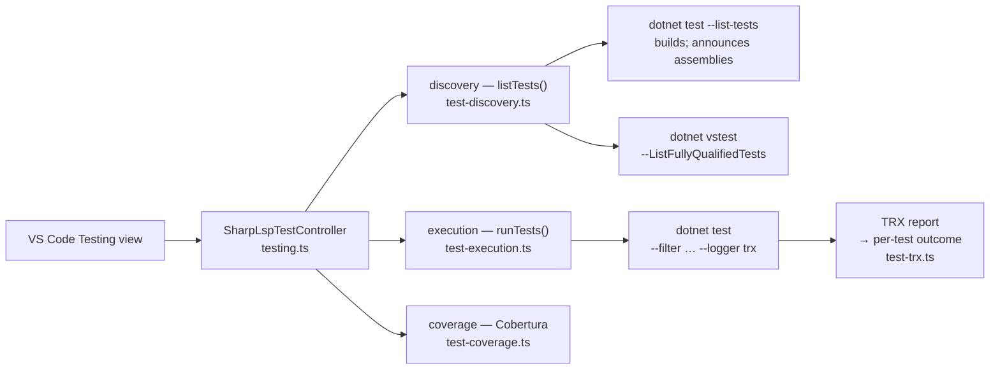

# Test Explorer Specification `[TEST-EXPLORER]`

## Overview `[TEST-OVERVIEW]`

The Test Explorer is the VS Code Testing-API surface for .NET test projects. It discovers
every test in the loaded solution (or, absent one, in each workspace folder), runs and
debugs them, and collects coverage. It is editor-side only: discovery and execution shell
out to the `dotnet` CLI, so no Roslyn or FCS sidecar is involved and no proprietary test
host is required.

It supports xUnit, NUnit, MSTest, Expecto and FsCheck, in **both C# and F#**. F# is not a
second-class case here: idiomatic F# backtick bindings produce fully-qualified names that
contain spaces, and an F# `[<TestClass>]` nested in a module produces a CLR nested-type name
containing `+`. Both must survive discovery, filtering and result attribution verbatim.

## Discovery by Fully-Qualified Name `[TEST-DISCOVERY-FQN]`

A test item's id MUST be the VSTest `TestCase.FullyQualifiedName`, because that is the only
value `dotnet test --filter FullyQualifiedName=` accepts. Discovery therefore runs in two
passes:

1. `dotnet test <target> --list-tests --nologo --verbosity quiet` — used to BUILD the
   projects and to learn, from the `Test run for <assembly> (<framework>)` banners, which
   test assemblies were produced. A solution prints one banner per project, and the banners
   and names of parallel projects interleave arbitrarily, so every line is classified
   independently; a banner-index slice is not admissible.
2. `dotnet vstest <assembly…> --ListFullyQualifiedTests --ListTestsTargetPath:<file>` —
   writes `TestCase.FullyQualifiedName` verbatim, one per line, to a file. The FILE is the
   source of truth: a non-zero exit with a populated file still counts.

The listing from pass 1 prints each test's **DisplayName**, not its FullyQualifiedName.
xUnit's DisplayName happens to equal `Namespace.Class.Method`, so scraping the listing
worked for xUnit by accident; NUnit and MSTest default their DisplayName to the BARE method
name, so those tests were dropped outright and could never have been run by FQN filter
(issue #180). The DisplayName listing survives only as a fallback for projects VSTest cannot
load at all (for example a Microsoft.Testing.Platform project).

Name shapes that MUST round-trip unchanged:

| Framework / language | Fully-qualified name |
|---|---|
| xUnit, C# | `Cs.Xunit.Fixtures.CalculatorTests.Adds_TwoNumbers` |
| xUnit `[Theory]`, C# | `Cs.Xunit.Fixtures.CalculatorTests.Adds_Theory` (no row data) |
| xUnit, F# backtick | `Fs.Xunit.Fixtures.adds two numbers with spaces` (SPACES) |
| NUnit `[TestCase]`, C# | `Cs.Nunit.Fixtures.CalculatorTests.Adds_Case(2,2,4)` (PARENTHESES) |
| MSTest `[DataRow]`, C# | `Cs.Mstest.Fixtures.CalculatorTests.Adds_Row` (no row data) |
| MSTest, F# | `Fs.Mstest.Fixtures+CalculatorTests.AddsTwoNumbers` (nested-type `+`) |

An adapter may DECORATE the name it reports. `xunit.runner.visualstudio` 2.2.0 — still
pinned by real-world projects — reports
`Ns.Class.Method (d87517d9ff18440615ea8de9ec508cb292e09385)`, appending the test case's
`UniqueID` (a SHA-1, 40 hex digits) after a SPACE. That decoration MUST be stripped before the
name becomes an id: kept, it labels the test with a hex blob, makes
`--filter FullyQualifiedName=` escape the parentheses and match nothing, and cannot be
reconciled with the TRX report, which keys on the bare `className.name` — so every test in
the project errors with "No result reported". Each row of a theory carries its own unique ID,
so stripping also collapses them onto the one name they share, as the table below requires.

Stripping MUST NOT touch a name that legitimately ends in parentheses: the NUnit `[TestCase]`
shape `Ns.Class.Adds_Case(2,2,4)` has no space before the `(` and no hex inside it, and both
conditions are what distinguish the two.

The assembly path in that banner comes through MSBuild, which reserves `%`, `*`, `?`, `@`,
`$`, `(`, `)`, `;`, `'` and `,` and encodes them as `%XX`. A solution under
`C:\Program Files (x86)\…` — the commonest Windows path with a reserved character — is
therefore announced as `C:\Program Files %28x86%29\…`, which does not exist. That path MUST be
decoded before the existence check: dropping it skips the fully-qualified pass entirely and
degrades discovery to DisplayName scraping, which silently loses every NUnit test, every MSTest
test and every theory. The raw banner text is preserved; the decode happens when resolving it
to a file.

Discovery MUST NOT throw. `listTests` resolves a `TestListing` carrying the names, an `ok`
flag saying whether the enumeration ran to completion, and warnings for the log. A sweep in
which NO target could be enumerated leaves the previously discovered tree standing rather
than blanking the Testing view on a transient `dotnet` failure.

A KILLED `dotnet` process (timeout or signal) is always fatal to a sweep: its stdout is
truncated at an arbitrary point, so a partial listing must never be treated as complete. A
non-zero EXIT is tolerated when the output still carried a parseable listing — a sibling
project failing to build must not hide the tests that did enumerate.

Assemblies are handed to `dotnet vstest` in batches whose joined argument text stays under
the Windows 32 767-character command-line ceiling; a solution with dozens of test projects
otherwise fails to spawn instead of enumerating.

A MULTI-TARGETED test project announces one banner per target framework, so
`<TargetFrameworks>net8.0;net9.0</TargetFrameworks>` reports two assemblies sharing a file
name under different `bin/<config>/<tfm>/` directories. They are ONE project and MUST
collapse to one assembly group: left apart, every namespace, class and test of that project
renders TWICE under two labels the user cannot tell apart. The collapsed group's names are
the UNION of the frameworks' listings, never the first framework's alone — a test compiled
behind `#if NET8_0` exists in only one assembly, and dropping it would trade a duplicated
tree for a missing test.

## Filter Grammar `[TEST-FILTER-ESCAPE]`

`--filter` takes an EXPRESSION, not a literal. `\`, `(`, `)`, `&`, `|`, `=`, `!` and `~` are
grammar and MUST be backslash-escaped inside a fully-qualified name before substitution. An
unescaped NUnit `[TestCase]` name crashes the NUnit adapter
(`VsTestFilter.get_IsEmpty()`), so the run dies instead of reporting a result. Multiple
selected tests are OR'd with an UNESCAPED `|` between escaped clauses.

Escaping is necessary but not sufficient. An adapter may REFUSE a syntactically valid
filter: NUnit's own filter parser rejects any fully-qualified name containing a SPACE
(`Unexpected Word 'on' at position 43 in selection expression`), which is every idiomatic F#
backtick test in an NUnit project. TRX records that refusal structurally, as a run-level
`RunInfo` with `outcome="Error"` — distinct from the `outcome="Warning"` VSTest writes for
"No test matches the given testcase filter". When a selected test has no result AND an
adapter recorded such an error, the selection is re-run ONCE **without a filter** and the
per-test outcomes are picked out of the report by name. Slower, but correct, and only ever
on the adapter's own say-so — never on a filter that legitimately matched nothing.

## Execution and Outcome Attribution `[TEST-RUN-TRX]`

A run is ONE `dotnet test` invocation for the whole selection, never one per test: a class of
twenty tests otherwise pays twenty restores and builds, which exceeds any sane timeout on a
Windows agent. Per-test outcomes come from the TRX report VSTest writes for that run:

* `--logger trx` is used WITHOUT `LogFileName`. A solution runs one VSTest session per
  project, and a fixed file name makes each session overwrite the previous one, losing every
  project's results but the last. Auto-named, VSTest writes `<name>.trx`, `<name>[1].trx`, …
  and every `.trx` created by the run is read back.
* A result's `testName` is the DISPLAY name. The fully-qualified name is reconstructed from
  the test's definition as `TestMethod/@className` + `.` + `TestMethod/@name`, which
  reproduces `TestCase.FullyQualifiedName` exactly for all three frameworks in both
  languages.
* TRX outcomes map onto the Testing API as `Passed` → passed, `Failed`/`Error`/`Timeout`/
  `Aborted` → failed, `NotExecuted`/`Inconclusive` → **skipped**. A skipped test MUST NOT be
  reported as a failure.
* A data-driven test writes one TRX entry PER ROW under the SAME fully-qualified name. The
  merged outcome is the WORST row's, and the durations sum. Keeping the last row seen would
  report a green tree for a theory whose second row failed.
* The assertion text and stack trace come from the TRX `ErrorInfo`, so a failure shows what
  actually went wrong instead of a generic "Test failed".
* A selected test with no TRX entry is reported as **errored**, carrying the process-level
  failure (a build error) or a note that the filter matched nothing. It is never silently
  reported as a pass.

## Reactivity `[TEST-REACTIVITY]`

Discovery runs a full build, so it is NOT a side effect of merely loading a solution. Only
once the user has engaged the Testing view — revealed it (`resolveHandler`) or pressed
refresh (`refreshHandler`) — does the controller become active. From then on a change to the
shared `state.solutionPath` signal reactively re-discovers with no manual refresh, debounced
by one second to collapse the burst a solution load emits. A monotonic generation counter
ensures a superseded sweep never clobbers a newer one.

Every `dotnet` invocation the controller makes is serialized through a single queue.
Discovery builds the solution and a run rebuilds the same projects, so two overlapping
invocations race on the shared `bin/`/`obj/` output and VSTest dies with "The application to
execute does not exist: …testhost.dll". `whenIdle()` resolves once the queue has drained.

## Environment `[TEST-ENV-LOCALE]`

Every outcome the extension parses is decided by matching ENGLISH text the .NET CLI and
VSTest emit (`Passed!`, `Error Message:`, `Test run for `). Those strings are localized, so
`DOTNET_CLI_UI_LANGUAGE=en-US` is pinned on every spawned `dotnet` process. Without it a
German or Japanese Windows install parses nothing and reports every test as failed.

`dotnet` children are spawned with a 600 s ceiling and a 64 MiB stdout buffer. Node's
defaults — 1 MiB and no timeout on `execFile` unless set — are blown by a cold restore on a
Windows agent, which surfaced as "Test execution error" with no further detail.

## Test Status Lens `[TEST-STATUS-LENS]`

`sharplsp.testLens.enabled` (default true) puts a CodeLens above every C# and F# test method
showing its last known result plus Run and Debug actions. The status title reflects the
Testing API's three states: `$(pass) Passed (<duration>)`, `$(debug-step-over) Skipped`,
`$(circle-slash) Not run`, and `$(error) Failed: <assertion text>`.

## Coverage `[TEST-COVERAGE]`

The Run-with-Coverage profile adds `--collect:XPlat Code Coverage` and points
`--results-directory` at a freshly emptied `<solution folder>/.sharplsp-coverage` — reusing the
directory would show the previous run's report. The collector writes one Cobertura report per
test project, each in its own run-id folder one level down, and **every** one of them is parsed
into `vscode.FileCoverage` entries and attached to the run; taking only the first drops every
other project's coverage, and which one is "first" is directory order. Per-file detail is
resolved lazily through `loadDetailedCoverage`.

`coverlet.collector` leaves the TEST assembly out of its report by default
(`IncludeTestAssembly` is false) and only reports assemblies the run actually loaded, so a
coverage fixture has to be a library plus a test project that exercises it — a solution of
nothing but test projects yields a valid, empty report.

## Testing `[TEST-EXPLORER-TESTS]`

Coverage is end-to-end only, inside the real VS Code extension host, against real projects
the `dotnet` CLI built — never mocks and never a hand-authored `.sln`. The suites live in
`src/editors/vscode/src/test/suite/`:

| Suite | Scope |
|---|---|
| `test-explorer-e2e.test.ts` | discovery of a mixed C#/F# xUnit solution, tree shape, reactive reload, refresh, the discovery parsers over a REAL listing, Windows listing shapes, assembly batching |
| `test-explorer-frameworks.test.ts` | xUnit, NUnit and MSTest × C# and F# in one solution: every FQN shape discovered and run |
| `test-explorer-outcomes.test.ts` | run profiles, pass/fail/skip attribution, assertion messages, multi-row theories, coverage, debug, cancellation |
| `test-explorer-windows.test.ts` | paths carrying spaces and parentheses, filter escaping, TRX and console parsing, CRLF, BOM, locale pinning |
| `test-explorer-reactive.test.ts` | debounce, generation guard, edit-then-refresh round trips, adding and removing a project, tree preserved on failure |
| `testing-lens-e2e.test.ts` | the at-cursor commands and the status CodeLens |

Every suite is declared in `src/editors/vscode/test-chunks.json` so it runs in the Windows
matrix ([DIST-CI-WIN-VSIX]).
