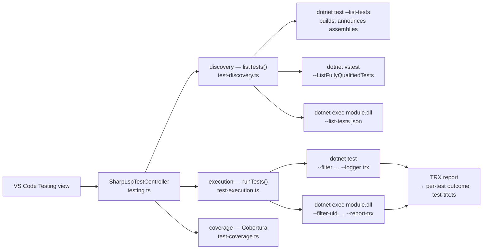

# Test Explorer Specification `[TEST-EXPLORER]`

## Overview `[TEST-OVERVIEW]`

The Test Explorer is the VS Code Testing-API surface for .NET test projects. It discovers
every test in the loaded solution (or, absent one, in each workspace folder), runs and
debugs them, and collects coverage. It is editor-side only: discovery and execution shell
out to the `dotnet` CLI, so no Roslyn or FCS sidecar is involved and no proprietary test
host is required.

It supports xUnit, NUnit, MSTest, Expecto and FsCheck, in **both C# and F#**. F# is not a
second-class case here: idiomatic F# backtick bindings produce fully-qualified names that
contain spaces, and an F# `[<TestClass>]` nested in a module produces a CLR nested-type name
containing `+`. Both must survive discovery, filtering and result attribution verbatim.

There are TWO runners, and the Test Explorer supports both. VSTest is the older one.
Microsoft.Testing.Platform (MTP) is the newer one, and it is the default for `xunit.v3`
4.0.0 and later. The two paths share the tree, the TRX reader and every report step; they
differ only in the commands that discover and run the tests ([TEST-MTP-DETECT]).



## Discovery by Fully-Qualified Name `[TEST-DISCOVERY-FQN]`

A test item's id MUST be the VSTest `TestCase.FullyQualifiedName`, because that is the only
value `dotnet test --filter FullyQualifiedName=` accepts. Discovery therefore runs in two
passes:

1. `dotnet test <target> --list-tests --nologo --verbosity quiet` — used to BUILD the
   projects and to learn, from the `Test run for <assembly> (<framework>)` banners, which
   test assemblies were produced. A solution prints one banner per project, and the banners
   and names of parallel projects interleave arbitrarily, so every line is classified
   independently; a banner-index slice is not admissible.
2. `dotnet vstest <assembly…> --ListFullyQualifiedTests --ListTestsTargetPath:<file>` —
   writes `TestCase.FullyQualifiedName` verbatim, one per line, to a file. The FILE is the
   source of truth: a non-zero exit with a populated file still counts.

The listing from pass 1 prints each test's **DisplayName**, not its FullyQualifiedName.
xUnit's DisplayName happens to equal `Namespace.Class.Method`, so scraping the listing
worked for xUnit by accident; NUnit and MSTest default their DisplayName to the BARE method
name, so those tests were dropped outright and could never have been run by FQN filter
(issue #180). The DisplayName listing survives only as a last-resort fallback for a project
that neither runner could enumerate. A Microsoft.Testing.Platform project is NOT that case:
it has its own discovery path ([TEST-MTP-DISCOVERY]).

Name shapes that MUST round-trip unchanged:

| Framework / language | Fully-qualified name |
|---|---|
| xUnit, C# | `Cs.Xunit.Fixtures.CalculatorTests.Adds_TwoNumbers` |
| xUnit `[Theory]`, C# | `Cs.Xunit.Fixtures.CalculatorTests.Adds_Theory` (no row data) |
| xUnit, F# backtick | `Fs.Xunit.Fixtures.adds two numbers with spaces` (SPACES) |
| NUnit `[TestCase]`, C# | `Cs.Nunit.Fixtures.CalculatorTests.Adds_Case(2,2,4)` (PARENTHESES) |
| MSTest `[DataRow]`, C# | `Cs.Mstest.Fixtures.CalculatorTests.Adds_Row` (no row data) |
| MSTest, F# | `Fs.Mstest.Fixtures+CalculatorTests.AddsTwoNumbers` (nested-type `+`) |

An adapter may DECORATE the name it reports. `xunit.runner.visualstudio` 2.2.0 — still
pinned by real-world projects — reports
`Ns.Class.Method (d87517d9ff18440615ea8de9ec508cb292e09385)`, appending the test case's
`UniqueID` (a SHA-1, 40 hex digits) after a SPACE. That decoration MUST be stripped before the
name becomes an id: kept, it labels the test with a hex blob, makes
`--filter FullyQualifiedName=` escape the parentheses and match nothing, and cannot be
reconciled with the TRX report, which keys on the bare `className.name` — so every test in
the project errors with "No result reported". Each row of a theory carries its own unique ID,
so stripping also collapses them onto the one name they share, as the table below requires.

Stripping MUST NOT touch a name that legitimately ends in parentheses: the NUnit `[TestCase]`
shape `Ns.Class.Adds_Case(2,2,4)` has no space before the `(` and no hex inside it, and both
conditions are what distinguish the two.

The assembly path in that banner comes through MSBuild, which reserves `%`, `*`, `?`, `@`,
`$`, `(`, `)`, `;`, `'` and `,` and encodes them as `%XX`. A solution under
`C:\Program Files (x86)\…` — the commonest Windows path with a reserved character — is
therefore announced as `C:\Program Files %28x86%29\…`, which does not exist. That path MUST be
decoded before the existence check: dropping it skips the fully-qualified pass entirely and
degrades discovery to DisplayName scraping, which silently loses every NUnit test, every MSTest
test and every theory. The raw banner text is preserved; the decode happens when resolving it
to a file.

Discovery MUST NOT throw. `listTests` resolves a `TestListing` carrying the names, an `ok`
flag saying whether the enumeration ran to completion, and warnings for the log. A sweep in
which NO target could be enumerated leaves the previously discovered tree standing rather
than blanking the Testing view on a transient `dotnet` failure.

A KILLED `dotnet` process (timeout or signal) is always fatal to a sweep: its stdout is
truncated at an arbitrary point, so a partial listing must never be treated as complete. A
non-zero EXIT is tolerated when the output still carried a parseable listing — a sibling
project failing to build must not hide the tests that did enumerate.

Assemblies are handed to `dotnet vstest` in batches whose joined argument text stays under
the Windows 32 767-character command-line ceiling; a solution with dozens of test projects
otherwise fails to spawn instead of enumerating.

A MULTI-TARGETED test project announces one banner per target framework, so
`<TargetFrameworks>net8.0;net9.0</TargetFrameworks>` reports two assemblies sharing a file
name under different `bin/<config>/<tfm>/` directories. They are ONE project and MUST
collapse to one assembly group: left apart, every namespace, class and test of that project
renders TWICE under two labels the user cannot tell apart. The collapsed group's names are
the UNION of the frameworks' listings, never the first framework's alone — a test compiled
behind `#if NET8_0` exists in only one assembly, and dropping it would trade a duplicated
tree for a missing test.

## Filter Grammar `[TEST-FILTER-ESCAPE]`

`--filter` takes an EXPRESSION, not a literal. `\`, `(`, `)`, `&`, `|`, `=`, `!` and `~` are
grammar and MUST be backslash-escaped inside a fully-qualified name before substitution. An
unescaped NUnit `[TestCase]` name crashes the NUnit adapter
(`VsTestFilter.get_IsEmpty()`), so the run dies instead of reporting a result. Multiple
selected tests are OR'd with an UNESCAPED `|` between escaped clauses.

Escaping is necessary but not sufficient. An adapter may REFUSE a syntactically valid
filter: NUnit's own filter parser rejects any fully-qualified name containing a SPACE
(`Unexpected Word 'on' at position 43 in selection expression`), which is every idiomatic F#
backtick test in an NUnit project. TRX records that refusal structurally, as a run-level
`RunInfo` with `outcome="Error"` — distinct from the `outcome="Warning"` VSTest writes for
"No test matches the given testcase filter". When a selected test has no result AND an
adapter recorded such an error, the selection is re-run ONCE **without a filter** and the
per-test outcomes are picked out of the report by name. Slower, but correct, and only ever
on the adapter's own say-so — never on a filter that legitimately matched nothing.

## Execution and Outcome Attribution `[TEST-RUN-TRX]`

A run is ONE `dotnet test` invocation for the whole selection, never one per test: a class of
twenty tests otherwise pays twenty restores and builds, which exceeds any sane timeout on a
Windows agent. Per-test outcomes come from the TRX report VSTest writes for that run:

* `--logger trx` is used WITHOUT `LogFileName`. A solution runs one VSTest session per
  project, and a fixed file name makes each session overwrite the previous one, losing every
  project's results but the last. Auto-named, VSTest writes `<name>.trx`, `<name>[1].trx`, …
  and every `.trx` created by the run is read back.
* A result's `testName` is the DISPLAY name. The fully-qualified name is reconstructed from
  the test's definition as `TestMethod/@className` + `.` + `TestMethod/@name`, which
  reproduces `TestCase.FullyQualifiedName` exactly for all three frameworks in both
  languages.
* TRX outcomes map onto the Testing API as `Passed` → passed, `Failed`/`Error`/`Timeout`/
  `Aborted` → failed, `NotExecuted`/`Inconclusive` → **skipped**. A skipped test MUST NOT be
  reported as a failure.
* A data-driven test writes one TRX entry PER ROW under the SAME fully-qualified name. The
  merged outcome is the WORST row's, and the durations sum. Keeping the last row seen would
  report a green tree for a theory whose second row failed.
* The assertion text and stack trace come from the TRX `ErrorInfo`, so a failure shows what
  actually went wrong instead of a generic "Test failed".
* A selected test with no TRX entry is reported as **errored**, carrying the process-level
  failure (a build error) or a note that the filter matched nothing. It is never silently
  reported as a pass.

## Microsoft.Testing.Platform: which runner `[TEST-MTP-DETECT]`

Microsoft.Testing.Platform (MTP) is the second .NET test runner. A test project that uses it
builds to an EXECUTABLE test module, and that module — not `vstest.console` — discovers and
runs its own tests. On the .NET 10 SDK, MTP v2 removed the VSTest shim, and `xunit.v3` 4.0.0
uses MTP v2 by default. Such a project is invisible to every VSTest command:

* `dotnet test --list-tests --nologo` — `--nologo` is not a valid MTP option. The SDK exits
  with code 5 and lists no test.
* `dotnet vstest <module>` — the module has no VSTest test host, so discovery dies with
  "The application to execute does not exist: …testhost.dll".
* `dotnet test --filter … --logger trx` — neither option exists in MTP mode.

The runner is chosen PER TARGET, not per project. The SDK makes MTP all-or-nothing: when
`global.json` opts in, a VSTest project in the same solution is an error. SharpLsp chooses
in two steps:

1. Find the nearest `global.json` above the target. Read it with a JSON parser, never with a
   regular expression or a string search. `test.runner` equal to `Microsoft.Testing.Platform`
   (letter case ignored) selects MTP immediately, and the two doomed VSTest passes are not
   run at all.
2. With no opt-in, run the VSTest passes first. Only if they produced no fully-qualified name
   does SharpLsp ask MSBuild. A project whose `IsTestingPlatformApplication` property is
   `true` is an MTP test module. `IsTestProject` MUST NOT be used for this: `xunit.v3` leaves
   it empty.

This order costs a VSTest solution nothing. It also keeps the MTP probe out of the hot path
for every sweep that already worked.

## Microsoft.Testing.Platform: the test modules `[TEST-MTP-MODULES]`

MTP prints no `Test run for <assembly>` banner, so the assemblies cannot be scraped out of a
listing. They come from MSBuild, which is the only source that survives a custom
`AssemblyName`, a custom `OutputPath`, an `ArtifactsPath` or a `RuntimeIdentifier`:

1. `dotnet build <target>` once. It builds the same projects a VSTest sweep builds.
2. `dotnet sln <solution> list` for the projects. The first two lines are a header and are
   dropped; the rest are project paths RELATIVE to the solution. With no solution loaded,
   the workspace folder is searched for `*.csproj` and `*.fsproj` instead.
3. `dotnet msbuild <project> -getProperty:IsTestingPlatformApplication -getProperty:TargetPath`
   per project. `TargetPath` of an MTP project is its test module.

A multi-targeted project reports one module per target framework. They are ONE project and
MUST collapse to one tree root, by the same union rule as [TEST-DISCOVERY-FQN].

## Microsoft.Testing.Platform: discovery `[TEST-MTP-DISCOVERY]`

Each module is asked directly: `dotnet exec <module.dll> --list-tests json --no-banner`.
`dotnet test` cannot be used here — it does not forward the `json` argument (dotnet/sdk#49754)
— and `dotnet exec` runs the module on every platform without an apphost or an execute bit.

The module answers with a JSON document on standard output:

```json
{ "schemaVersion": 1,
  "tests": [ { "uid": "9e472c8a…", "displayName": "Cs.Xunit.Mtp.CalculatorTests.Adds_TwoNumbers",
               "type": { "namespace": "Cs.Xunit.Mtp", "typeName": "CalculatorTests",
                         "methodName": "Adds_TwoNumbers" },
               "location": { "file": "…/CalculatorTests.cs", "lineStart": 7, "lineEnd": 7 } } ] }
```

Three fields, three jobs, and they MUST NOT be confused:

* **`type`** gives the test item's id, as `namespace` + `.` + `typeName` + `.` + `methodName`.
  The id MUST come from here and never from `displayName`. MSTest reports the BARE method
  name as its display name — `Adds_TwoNumbers`, with no namespace and no class — which is the
  same defect as issue #180. `type` also carries no row data, so the rows of one data-driven
  test collapse onto the one id they share, exactly as the VSTest path requires. The
  reconstructed id is identical to the `className` + `.` + `name` pair the TRX report holds,
  so [TEST-RUN-TRX] attributes MTP outcomes with no change at all.
* **`uid`** is the run key, and nothing else. Its shape is the framework's business: a SHA-256
  digest for `xunit.v3`, a GUID for MSTest, and the decorated name
  `Cs.Nunit.Mtp.CalculatorTests.Adds_Case(2,2,4)` for NUnit. It is never shown and never
  parsed. One id can own SEVERAL uids — one per row of a data-driven test — and running that
  id runs all of them.
* **`location`** gives the test item its file and line. NUnit sends none, so the field is
  optional and its absence is not an error.

The reader tolerates a leading blank line and a byte-order mark, and it starts at the first
`{`. An unknown `schemaVersion` produces a warning, not an exception. A module that fails to
list leaves the other modules alone, the same contract as [TEST-DISCOVERY-FQN].

## Microsoft.Testing.Platform: runs `[TEST-MTP-RUN]`

One invocation per MODULE for the whole selection, never one per test:

```
dotnet exec <module.dll> --filter-uid <uid> <uid> … \
    --report-trx --report-trx-filename <module>.trx \
    --results-directory <dir> --no-banner --no-ansi
```

* `--filter-uid` takes LITERAL values, so the [TEST-FILTER-ESCAPE] grammar does not apply and
  MUST NOT be used. An NUnit uid contains parentheses and commas; escaping them would make it
  match nothing. The uids are still BATCHED against the Windows 32 767-character
  command-line ceiling, for the same reason the VSTest filter is.
* An empty selection means "run everything", and then no `--filter-uid` is sent.
* A module the selection does not touch is not started at all.
* `--report-trx-filename` is set per module. Two modules writing one auto-named file in a
  shared results directory would overwrite each other, which is the same defect
  [TEST-RUN-TRX] avoids with auto-naming under VSTest.
* `--no-progress` MUST NOT be used. MTP 2.3 deprecated it and prints a warning on every run.

The TRX report is read back by the reader [TEST-RUN-TRX] already specifies, and the worst-row
merge, the skip mapping and the assertion text all behave the same.

A framework bridged onto MTP can translate `--filter-uid` back into a VSTest filter
EXPRESSION and then REFUSE its own translation. NUnit does exactly that for any uid carrying
a SPACE — which is every idiomatic F# backtick binding, and the same refusal
[TEST-FILTER-ESCAPE] records for the VSTest path:

```
Unhandled exception. NUnit.VisualStudio.TestAdapter.TestFilterConverter.TestFilterParserException:
Unexpected FQN 'case\(2,2,4\)' at position 46 in selection expression.
```

The whole module then reports nothing, and perfectly runnable tests show as phantom
failures. The remedy is the one [TEST-FILTER-ESCAPE] already sets for VSTest: when a module
FAILED and left a selected test unreported, that module is re-run ONCE without a filter and
the outcomes are picked out of its report by name. Slower, but correct — and only ever when
the module failed, never on a selection that legitimately matched nothing. A retry's counts
REPLACE the refused attempt's; counts are summed only ACROSS modules.

`--report-trx` is an EXTENSION, not part of MTP. A module that does not register
`Microsoft.Testing.Extensions.TrxReport` rejects the option and exits with code 5, printing
`Unknown option '--report-trx'`. That exit code MUST be reported as itself: the message tells
the user to reference the package. A silent empty run would report every selected test as
"No result reported" and hide the cause.

Coverage is also an extension. MTP has no `--collect:"XPlat Code Coverage"`; it takes
`--coverage --coverage-output-format cobertura`, and it writes `<guid>.cobertura.xml`
DIRECTLY into the results directory, not one level below it as `coverlet.collector` does.
[TEST-COVERAGE] therefore reads both depths.

## Microsoft.Testing.Platform: debugging `[TEST-MTP-DEBUG]`

An MTP module IS the test host: there is no `testhost.dll` grandchild. `--debug` makes the
module print

```
Waiting for debugger to attach... Process Id: 212243, Name: dotnet
```

and then wait. The announcement carries the same `Process Id: <pid>, Name: <name>` text as
VSTest, but a prefix comes before it, so the pid reader MUST find that text anywhere in the
line rather than only at its start. Everything else in [DEBUG-FEATURES-TESTS] is unchanged:
one invocation, attach to the announced pid, mirror the output into the terminal, and write
no result to the cache.

## Reactivity `[TEST-REACTIVITY]`

Discovery runs a full build, so it is NOT a side effect of merely loading a solution. Only
once the user has engaged the Testing view — revealed it (`resolveHandler`) or pressed
refresh (`refreshHandler`) — does the controller become active. From then on a change to the
shared `state.solutionPath` signal reactively re-discovers with no manual refresh, debounced
by one second to collapse the burst a solution load emits. A monotonic generation counter
ensures a superseded sweep never clobbers a newer one.

Every `dotnet` invocation the controller makes is serialized through a single queue.
Discovery builds the solution and a run rebuilds the same projects, so two overlapping
invocations race on the shared `bin/`/`obj/` output and VSTest dies with "The application to
execute does not exist: …testhost.dll". `whenIdle()` resolves once the queue has drained.

## Environment `[TEST-ENV-LOCALE]`

Every outcome the extension parses is decided by matching ENGLISH text the .NET CLI and
VSTest emit (`Passed!`, `Error Message:`, `Test run for `). Those strings are localized, so
`DOTNET_CLI_UI_LANGUAGE=en-US` is pinned on every spawned `dotnet` process. Without it a
German or Japanese Windows install parses nothing and reports every test as failed.

`dotnet` children are spawned with a 600 s ceiling and a 64 MiB stdout buffer. Node's
defaults — 1 MiB and no timeout on `execFile` unless set — are blown by a cold restore on a
Windows agent, which surfaced as "Test execution error" with no further detail.

## Test Status Lens `[TEST-STATUS-LENS]`

`sharplsp.testLens.enabled` (default true) puts a CodeLens above every C# and F# test method
showing its last known result plus Run and Debug actions. The status title reflects the
Testing API's three states: `$(pass) Passed (<duration>)`, `$(debug-step-over) Skipped`,
`$(circle-slash) Not run`, and `$(error) Failed: <assertion text>`.

## Coverage `[TEST-COVERAGE]`

The Run-with-Coverage profile adds `--collect:XPlat Code Coverage` and points
`--results-directory` at a freshly emptied `<solution folder>/.sharplsp-coverage` — reusing the
directory would show the previous run's report. The collector writes one Cobertura report per
test project, each in its own run-id folder one level down, and **every** one of them is parsed
into `vscode.FileCoverage` entries and attached to the run; taking only the first drops every
other project's coverage, and which one is "first" is directory order. An MTP run collects
with `--coverage --coverage-output-format cobertura` instead, and that extension writes
`<guid>.cobertura.xml` DIRECTLY into the results directory. Both depths are read, so one
rule covers both runners ([TEST-MTP-RUN]). Per-file detail is
resolved lazily through `loadDetailedCoverage`.

`coverlet.collector` leaves the TEST assembly out of its report by default
(`IncludeTestAssembly` is false) and only reports assemblies the run actually loaded, so a
coverage fixture has to be a library plus a test project that exercises it — a solution of
nothing but test projects yields a valid, empty report.

## Testing `[TEST-EXPLORER-TESTS]`

Coverage is end-to-end only, inside the real VS Code extension host, against real projects
the `dotnet` CLI built — never mocks and never a hand-authored `.sln`. The suites live in
`src/editors/vscode/src/test/suite/`:

| Suite | Scope |
|---|---|
| `test-explorer-e2e.test.ts` | discovery of a mixed C#/F# xUnit solution, tree shape, reactive reload, refresh, the discovery parsers over a REAL listing, Windows listing shapes, assembly batching |
| `test-explorer-frameworks.test.ts` | xUnit, NUnit and MSTest × C# and F# in one solution: every FQN shape discovered and run |
| `test-explorer-outcomes.test.ts` | run profiles, pass/fail/skip attribution, assertion messages, multi-row theories, coverage, debug, cancellation |
| `test-explorer-windows.test.ts` | paths carrying spaces and parentheses, filter escaping, TRX and console parsing, CRLF, BOM, locale pinning |
| `test-explorer-reactive.test.ts` | debounce, generation guard, edit-then-refresh round trips, adding and removing a project, tree preserved on failure |
| `testing-lens-e2e.test.ts` | the at-cursor commands and the status CodeLens, and that the Run and Debug actions resolve the same method by name |
| `testing-lens-status.test.ts` | the STATUS lens as a real CodeLens over a built, discovered and RUN solution: "Not run" first, then each of the pass/fail/skip titles on its own method, reactive refresh with the editor open, and the enable setting governing the status as well as the actions |
| `test-explorer-names.test.ts` | the fully-qualified name reader at its boundary: a 40-hex adapter unique ID stripped, every near miss — 39 or 41 digits, no leading space, non-hex, empty or trailing brackets, the NUnit `Adds_Case(2,2,4)` shape — left verbatim, and a real listing file (BOM, CRLF, one line per theory row) collapsing to one id per test |
| `test-explorer-adapter-ids.test.ts` | an adapter that DECORATES the names it reports (`xunit.runner.visualstudio` 2.2.0): bare ids, readable labels, an unescaped filter, real TRX outcomes and a resolvable lens |
| `test-explorer-multitarget.test.ts` | a `<TargetFrameworks>` project collapsing to ONE assembly root whose names are the UNION of the frameworks' — proved with a test compiled behind `#if` into each framework's assembly and not the other's — and running both the merged root and one framework-exclusive test from it |
| `test-explorer-cancellation.test.ts` | pressing Stop, from every gesture that starts a run — the play button, Run with Coverage, a namespace row, the assembly root, a multi-select, an already-cancelled token, a late Stop, two cancellations back to back: the process TREE dies, results are suppressed, the tree stands and the `dotnet` queue drains |
| `test-explorer-coverage.test.ts` | the Coverage profile over TWO test projects covering one library: one report per project, EVERY one parsed, a freshly emptied results directory between runs, partial coverage, an empty report when nothing was loaded, and the Run profile collecting nothing ([TEST-COVERAGE]) |
| `debug-test-debugging-e2e.test.ts` | the Debug run profile on ONE test: a real DAP session attached to the waiting test host, a breakpoint in the body and in a helper, a failing test, a skipped one, `[Theory]` rows, nothing armed, and disabled/conditional breakpoints |
| `debug-test-groups-e2e.test.ts` | debugging a SELECTION: the class row, the namespace row, the assembly root, a multi-select across classes, and the unselected test that must not run |
| `debug-test-fsharp-e2e.test.ts` | F# first: a backtick name carrying SPACES debugged, its module helper on the stack, `[<Theory>]` rows, and Debug Test at the cursor |
| `test-explorer-mtp.test.ts` | Microsoft.Testing.Platform, end to end: the `global.json` opt-in and the `IsTestingPlatformApplication` probe, module resolution through MSBuild, and the tree for `xunit.v3`, MSTest and NUnit × C# and F# — including the MSTest bare display name that MUST NOT become an id, the F# backtick name carrying SPACES, and the source location the JSON listing carries ([TEST-MTP-DETECT], [TEST-MTP-MODULES], [TEST-MTP-DISCOVERY]) |
| `test-explorer-mtp-outcomes.test.ts` | MTP runs: pass, fail and skip attribution across all six projects, the assertion text, a data-driven test whose rows disagree collapsing onto one id, ▶ on one test and on a class row, ⏹, the unfiltered retry an F# NUnit refusal earns and the C# selection that must NOT be retried, and the exit-code-5 message a module without `Microsoft.Testing.Extensions.TrxReport` earns ([TEST-MTP-RUN]) |
| `test-explorer-mtp-parsers.test.ts` | the JSON listing reader at its boundary: a byte-order mark, a leading blank line, an unknown `schemaVersion`, an empty `tests` array, a missing `location`, a missing `type`, and two rows collapsing onto one id with two uids; the `global.json` opt-in against every decoy that merely mentions MTP; the uid batcher; and the waiting-host pid line in BOTH its bare and its prefixed form ([TEST-MTP-DETECT], [TEST-MTP-DISCOVERY], [TEST-MTP-RUN], [TEST-MTP-DEBUG]) |

Every suite is declared in `src/editors/vscode/test-chunks.json` so it runs in the Windows
matrix ([DIST-CI-WIN-VSIX]).
