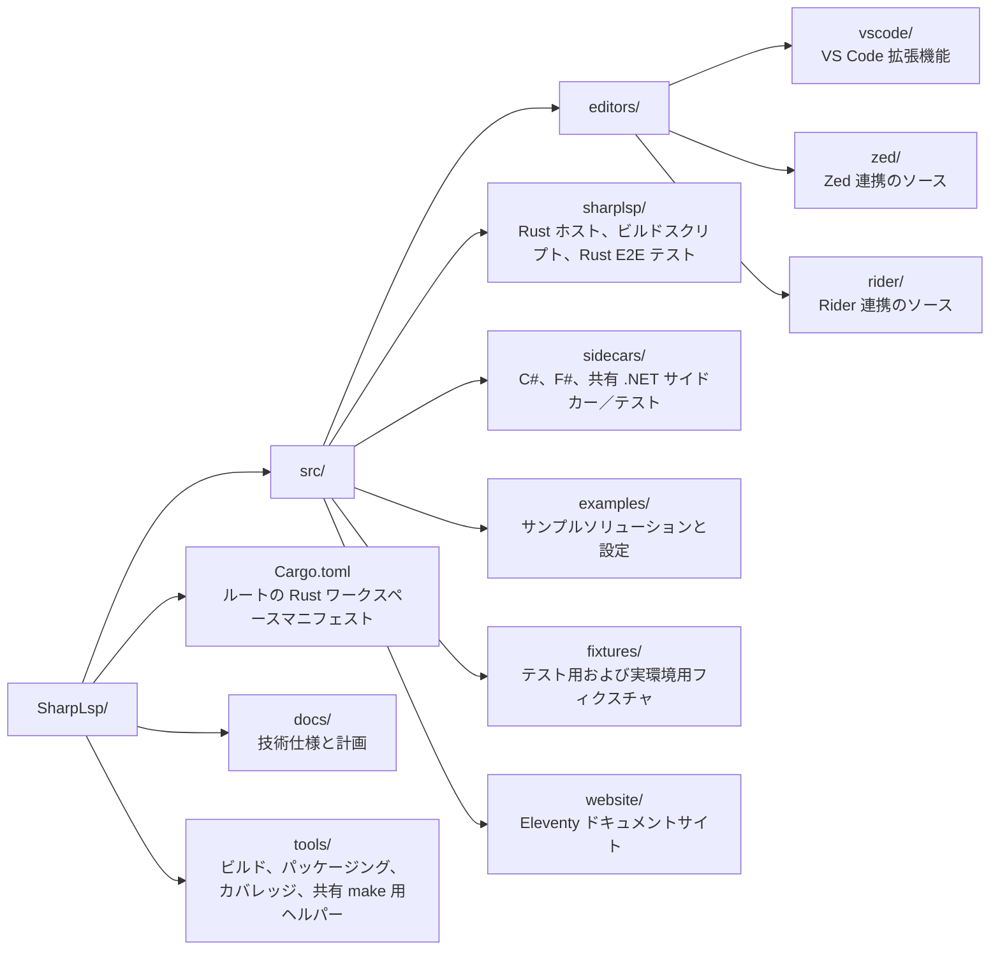

# コントリビュートとソースからのビルド

このページはコントリビューター向けです。通常、VS Code ユーザーはホストとサイドカーが同梱された Marketplace 拡張機能をインストールしてください。

## 前提条件

- [rustup](https://rustup.rs) でインストールした Rust stable
- .NET 10 SDK（リポジトリでは 10.0.203 を固定し、互換性のあるロールフォワードを許可しています）
- Node.js 20 以降
- Git

一部のプロファイラーテストには、グローバルツールの `dotnet-trace`、`dotnet-counters`、`dotnet-dump` も必要です。

## Dev Container

同梱の dev container には、プロジェクトで使用する Rust、.NET、Node、テストツールが用意されています。VS Code でリポジトリを開き、**Dev Containers: Reopen in Container** を選択します。

## リポジトリ構成



## ビルドとテスト

コマンドはリポジトリルートで実行します。

```sh
# Rust ホスト
cargo build
cargo clippy --all-targets --all-features
cargo test

# .NET サイドカー
dotnet test src/sidecars/SharpLsp.Sidecars.sln

# VS Code 拡張機能
npm --prefix src/editors/vscode ci
npm --prefix src/editors/vscode run lint
npm --prefix src/editors/vscode run package

# ウェブサイト
npm --prefix src/website ci
npm --prefix src/website run build
npm --prefix src/website test
```

拡張機能のエンドツーエンドテストスイートは、実際の SharpLsp バイナリをステージングし、VS Code テストホストを起動します。TypeScript のチェックより負荷が高いため、完全なマトリックスについてはリポジトリの Make ターゲットと CI ワークフローを信頼できる情報源として使用してください。

## アーキテクチャ

SharpLsp には 3 つのランタイム層があります。

- Rust LSP ホスト
- Roslyn C# サイドカー
- FCS F# サイドカー

IPC は、Windows では名前付きパイプ、Linux／macOS では Unix ドメインソケット上の MessagePack を使用します。層をまたぐ動作を変更する前に、[アーキテクチャ](/ja/docs/architecture/)を読んでください。

## ドキュメントのソース

公開ウェブサイトのドキュメントは `src/website/src/docs` にあり、日本語版と簡体字中国語版はそれぞれ `src/website/src/ja/docs` と `src/website/src/zh/docs` にあります。

技術的な動作仕様は `docs/specs` に、実装計画は `docs/plans` にあります。ユーザーから見える動作を変更するときは、公開ドキュメントと両方の翻訳を更新してください。

<p class="next-link"><a href="/ja/docs/architecture/">アーキテクチャ <span aria-hidden="true">→</span></a></p>
